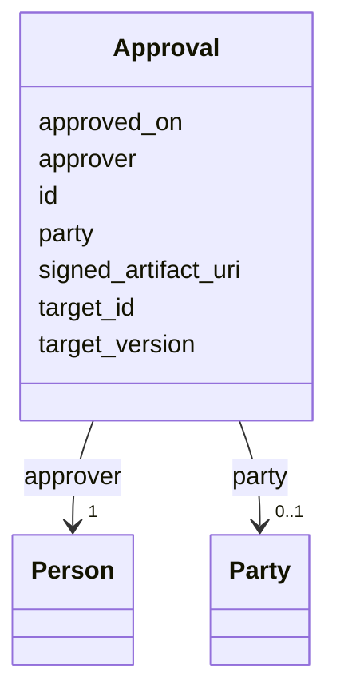

# Class: Approval 


_Signoff on a specific version of a SOW element._


URI: [fibo_ctr:ContractualCommitment](https://spec.edmcouncil.org/fibo/ontology/FND/Agreements/Contracts/ContractualCommitment)





<!-- no inheritance hierarchy -->


## Slots

| Name | Cardinality and Range | Description | Inheritance |
| ---  | --- | --- | --- |
| [id](id.md) | 1 <br/> [String](String.md) |  | direct |
| [approver](approver.md) | 1 <br/> [Person](Person.md) |  | direct |
| [party](party.md) | 0..1 <br/> [Party](Party.md) | Party the approver is signing on behalf of | direct |
| [target_id](target_id.md) | 1 <br/> [String](String.md) | ID of the element being approved | direct |
| [target_version](target_version.md) | 1 <br/> [String](String.md) | pav:version of the target at time of approval | direct |
| [approved_on](approved_on.md) | 1 <br/> [Date](Date.md) |  | direct |
| [signed_artifact_uri](signed_artifact_uri.md) | 0..1 <br/> [uri](uri.md) | Pointer to the executed envelope (DocuSign, etc | direct |


## Usages

| used by | used in | type | used |
| ---  | --- | --- | --- |
| [TaskTeam](TaskTeam.md) | [approvals](approvals.md) | range | [Approval](Approval.md) |
| [ChangeProposal](ChangeProposal.md) | [approvals](approvals.md) | range | [Approval](Approval.md) |


## Identifier and Mapping Information


### Schema Source


* from schema: https://w3id.org/collabri/sow


## Mappings

| Mapping Type | Mapped Value |
| ---  | ---  |
| self | fibo_ctr:ContractualCommitment |
| native | sow:Approval |
| related | lrml:Authority |
| close | accord:Signature, prov:Attribution |


## LinkML Source

<!-- TODO: investigate https://stackoverflow.com/questions/37606292/how-to-create-tabbed-code-blocks-in-mkdocs-or-sphinx -->

### Direct

<details>
```yaml
name: Approval
description: Signoff on a specific version of a SOW element.
from_schema: https://w3id.org/collabri/sow
close_mappings:
- accord:Signature
- prov:Attribution
related_mappings:
- lrml:Authority
attributes:
  id:
    name: id
    from_schema: https://w3id.org/collabri/sow
    identifier: true
    domain_of:
    - NamedThing
    - Approval
    - ChangeProposal
    - Change
    required: true
  approver:
    name: approver
    from_schema: https://w3id.org/collabri/sow
    rank: 1000
    domain_of:
    - Approval
    range: Person
    required: true
    inlined: true
  party:
    name: party
    description: Party the approver is signing on behalf of.
    from_schema: https://w3id.org/collabri/sow
    rank: 1000
    domain_of:
    - Approval
    range: Party
    inlined: true
  target_id:
    name: target_id
    description: ID of the element being approved.
    from_schema: https://w3id.org/collabri/sow
    rank: 1000
    domain_of:
    - Approval
    - Change
    required: true
  target_version:
    name: target_version
    description: pav:version of the target at time of approval.
    from_schema: https://w3id.org/collabri/sow
    rank: 1000
    domain_of:
    - Approval
    required: true
  approved_on:
    name: approved_on
    from_schema: https://w3id.org/collabri/sow
    rank: 1000
    domain_of:
    - Approval
    range: date
    required: true
  signed_artifact_uri:
    name: signed_artifact_uri
    description: Pointer to the executed envelope (DocuSign, etc.).
    from_schema: https://w3id.org/collabri/sow
    rank: 1000
    domain_of:
    - Approval
    range: uri
class_uri: fibo_ctr:ContractualCommitment

```
</details>

### Induced

<details>
```yaml
name: Approval
description: Signoff on a specific version of a SOW element.
from_schema: https://w3id.org/collabri/sow
close_mappings:
- accord:Signature
- prov:Attribution
related_mappings:
- lrml:Authority
attributes:
  id:
    name: id
    from_schema: https://w3id.org/collabri/sow
    identifier: true
    alias: id
    owner: Approval
    domain_of:
    - NamedThing
    - Approval
    - ChangeProposal
    - Change
    range: string
    required: true
  approver:
    name: approver
    from_schema: https://w3id.org/collabri/sow
    rank: 1000
    alias: approver
    owner: Approval
    domain_of:
    - Approval
    range: Person
    required: true
    inlined: true
  party:
    name: party
    description: Party the approver is signing on behalf of.
    from_schema: https://w3id.org/collabri/sow
    rank: 1000
    alias: party
    owner: Approval
    domain_of:
    - Approval
    range: Party
    inlined: true
  target_id:
    name: target_id
    description: ID of the element being approved.
    from_schema: https://w3id.org/collabri/sow
    rank: 1000
    alias: target_id
    owner: Approval
    domain_of:
    - Approval
    - Change
    range: string
    required: true
  target_version:
    name: target_version
    description: pav:version of the target at time of approval.
    from_schema: https://w3id.org/collabri/sow
    rank: 1000
    alias: target_version
    owner: Approval
    domain_of:
    - Approval
    range: string
    required: true
  approved_on:
    name: approved_on
    from_schema: https://w3id.org/collabri/sow
    rank: 1000
    alias: approved_on
    owner: Approval
    domain_of:
    - Approval
    range: date
    required: true
  signed_artifact_uri:
    name: signed_artifact_uri
    description: Pointer to the executed envelope (DocuSign, etc.).
    from_schema: https://w3id.org/collabri/sow
    rank: 1000
    alias: signed_artifact_uri
    owner: Approval
    domain_of:
    - Approval
    range: uri
class_uri: fibo_ctr:ContractualCommitment

```
</details>