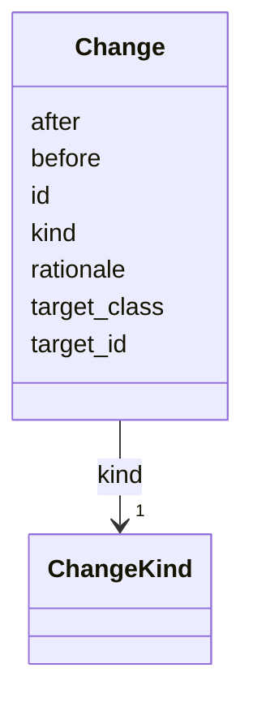

# Class: Change 


_Single element-level edit within a ChangeProposal. Adds, modifies, or removes a Task, Subtask, Milestone, Deliverable, etc. The before/after snapshots provide the per-element diff that mirrors GitHub's per-file view; the ChangeProposal aggregates them into the PR-level unit._


URI: [prov:Activity](http://www.w3.org/ns/prov#Activity)





<!-- no inheritance hierarchy -->


## Slots

| Name | Cardinality and Range | Description | Inheritance |
| ---  | --- | --- | --- |
| [id](id.md) | 1 <br/> [String](String.md) |  | direct |
| [kind](kind.md) | 1 <br/> [ChangeKind](ChangeKind.md) |  | direct |
| [target_id](target_id.md) | 1 <br/> [String](String.md) | ID of the SOW element being changed | direct |
| [target_class](target_class.md) | 1 <br/> [String](String.md) | Class of the target (Task, Subtask, Milestone, Deliverable,  | direct |
| [before](before.md) | 0..1 <br/> [String](String.md) | Snapshot of the element before the change (null for adds) | direct |
| [after](after.md) | 0..1 <br/> [String](String.md) | Snapshot of the element after the change (null for removes) | direct |
| [rationale](rationale.md) | 0..1 <br/> [String](String.md) |  | direct |


## Usages

| used by | used in | type | used |
| ---  | --- | --- | --- |
| [ChangeProposal](ChangeProposal.md) | [changes](changes.md) | range | [Change](Change.md) |


## Identifier and Mapping Information


### Schema Source


* from schema: https://w3id.org/collabri/sow


## Mappings

| Mapping Type | Mapped Value |
| ---  | ---  |
| self | prov:Activity |
| native | sow:Change |


## LinkML Source

<!-- TODO: investigate https://stackoverflow.com/questions/37606292/how-to-create-tabbed-code-blocks-in-mkdocs-or-sphinx -->

### Direct

<details>
```yaml
name: Change
description: Single element-level edit within a ChangeProposal. Adds, modifies, or
  removes a Task, Subtask, Milestone, Deliverable, etc. The before/after snapshots
  provide the per-element diff that mirrors GitHub's per-file view; the ChangeProposal
  aggregates them into the PR-level unit.
from_schema: https://w3id.org/collabri/sow
attributes:
  id:
    name: id
    from_schema: https://w3id.org/collabri/sow
    identifier: true
    domain_of:
    - NamedThing
    - Approval
    - ChangeProposal
    - Change
    required: true
  kind:
    name: kind
    from_schema: https://w3id.org/collabri/sow
    rank: 1000
    domain_of:
    - Change
    range: ChangeKind
    required: true
  target_id:
    name: target_id
    description: ID of the SOW element being changed.
    from_schema: https://w3id.org/collabri/sow
    domain_of:
    - Approval
    - Change
    required: true
  target_class:
    name: target_class
    description: Class of the target (Task, Subtask, Milestone, Deliverable, ...).
    from_schema: https://w3id.org/collabri/sow
    rank: 1000
    domain_of:
    - Change
    required: true
  before:
    name: before
    description: Snapshot of the element before the change (null for adds).
    from_schema: https://w3id.org/collabri/sow
    rank: 1000
    domain_of:
    - Change
  after:
    name: after
    description: Snapshot of the element after the change (null for removes).
    from_schema: https://w3id.org/collabri/sow
    rank: 1000
    domain_of:
    - Change
  rationale:
    name: rationale
    from_schema: https://w3id.org/collabri/sow
    domain_of:
    - ChangeProposal
    - Change
class_uri: prov:Activity

```
</details>

### Induced

<details>
```yaml
name: Change
description: Single element-level edit within a ChangeProposal. Adds, modifies, or
  removes a Task, Subtask, Milestone, Deliverable, etc. The before/after snapshots
  provide the per-element diff that mirrors GitHub's per-file view; the ChangeProposal
  aggregates them into the PR-level unit.
from_schema: https://w3id.org/collabri/sow
attributes:
  id:
    name: id
    from_schema: https://w3id.org/collabri/sow
    identifier: true
    alias: id
    owner: Change
    domain_of:
    - NamedThing
    - Approval
    - ChangeProposal
    - Change
    range: string
    required: true
  kind:
    name: kind
    from_schema: https://w3id.org/collabri/sow
    rank: 1000
    alias: kind
    owner: Change
    domain_of:
    - Change
    range: ChangeKind
    required: true
  target_id:
    name: target_id
    description: ID of the SOW element being changed.
    from_schema: https://w3id.org/collabri/sow
    alias: target_id
    owner: Change
    domain_of:
    - Approval
    - Change
    range: string
    required: true
  target_class:
    name: target_class
    description: Class of the target (Task, Subtask, Milestone, Deliverable, ...).
    from_schema: https://w3id.org/collabri/sow
    rank: 1000
    alias: target_class
    owner: Change
    domain_of:
    - Change
    range: string
    required: true
  before:
    name: before
    description: Snapshot of the element before the change (null for adds).
    from_schema: https://w3id.org/collabri/sow
    rank: 1000
    alias: before
    owner: Change
    domain_of:
    - Change
    range: string
  after:
    name: after
    description: Snapshot of the element after the change (null for removes).
    from_schema: https://w3id.org/collabri/sow
    rank: 1000
    alias: after
    owner: Change
    domain_of:
    - Change
    range: string
  rationale:
    name: rationale
    from_schema: https://w3id.org/collabri/sow
    alias: rationale
    owner: Change
    domain_of:
    - ChangeProposal
    - Change
    range: string
class_uri: prov:Activity

```
</details>