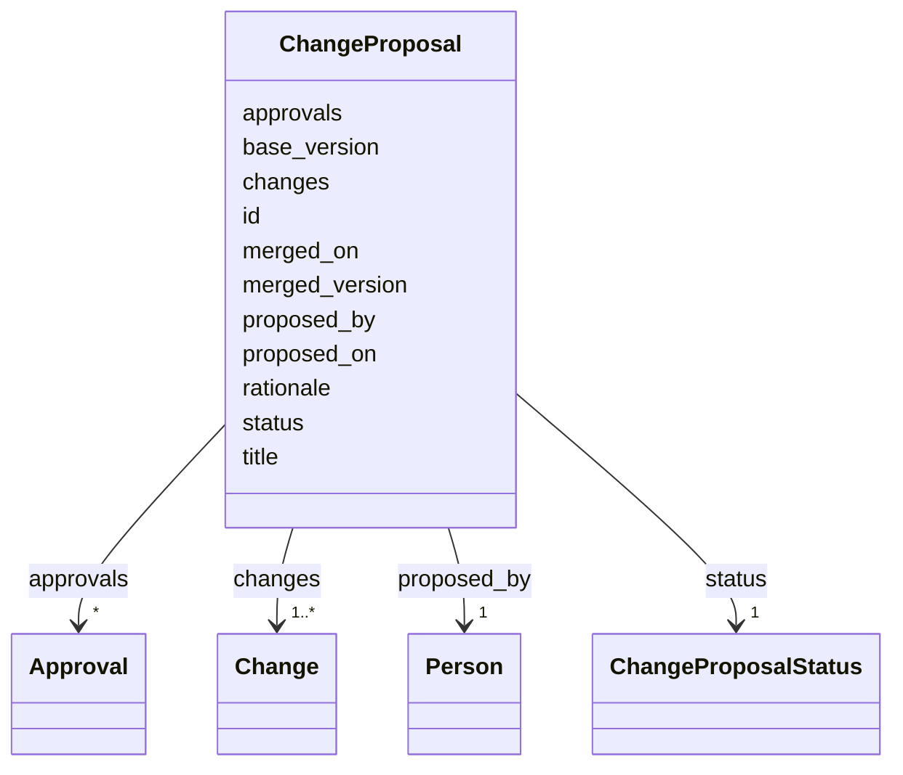

# Class: ChangeProposal 


_A bundled set of element-level Changes against a base SOW version, analogous to a GitHub pull request. Resolves into a new TaskTeam (SOW) version upon merge. Each touched element gets a new pav:version with prov:wasRevisionOf pointing at its prior version._


URI: [fibo_ctr:Amendment](https://spec.edmcouncil.org/fibo/ontology/FND/Agreements/Contracts/Amendment)





<!-- no inheritance hierarchy -->


## Slots

| Name | Cardinality and Range | Description | Inheritance |
| ---  | --- | --- | --- |
| [id](id.md) | 1 <br/> [String](String.md) |  | direct |
| [title](title.md) | 1 <br/> [String](String.md) |  | direct |
| [rationale](rationale.md) | 0..1 <br/> [String](String.md) |  | direct |
| [proposed_by](proposed_by.md) | 1 <br/> [Person](Person.md) |  | direct |
| [proposed_on](proposed_on.md) | 1 <br/> [Date](Date.md) |  | direct |
| [base_version](base_version.md) | 1 <br/> [String](String.md) | Version of the SOW this proposal targets | direct |
| [status](status.md) | 1 <br/> [ChangeProposalStatus](ChangeProposalStatus.md) |  | direct |
| [changes](changes.md) | 1..* <br/> [Change](Change.md) |  | direct |
| [merged_on](merged_on.md) | 0..1 <br/> [Date](Date.md) |  | direct |
| [merged_version](merged_version.md) | 0..1 <br/> [String](String.md) | Resulting SOW semver after merge | direct |
| [approvals](approvals.md) | * <br/> [Approval](Approval.md) |  | direct |


## Usages

| used by | used in | type | used |
| ---  | --- | --- | --- |
| [TaskTeam](TaskTeam.md) | [change_proposals](change_proposals.md) | range | [ChangeProposal](ChangeProposal.md) |


## Identifier and Mapping Information


### Schema Source


* from schema: https://w3id.org/collabri/sow


## Mappings

| Mapping Type | Mapped Value |
| ---  | ---  |
| self | fibo_ctr:Amendment |
| native | sow:ChangeProposal |
| close | accord:Amendment, prov:Activity, lkif:Amendment |


## LinkML Source

<!-- TODO: investigate https://stackoverflow.com/questions/37606292/how-to-create-tabbed-code-blocks-in-mkdocs-or-sphinx -->

### Direct

<details>
```yaml
name: ChangeProposal
description: A bundled set of element-level Changes against a base SOW version, analogous
  to a GitHub pull request. Resolves into a new TaskTeam (SOW) version upon merge.
  Each touched element gets a new pav:version with prov:wasRevisionOf pointing at
  its prior version.
from_schema: https://w3id.org/collabri/sow
close_mappings:
- accord:Amendment
- prov:Activity
- lkif:Amendment
attributes:
  id:
    name: id
    from_schema: https://w3id.org/collabri/sow
    identifier: true
    domain_of:
    - NamedThing
    - Approval
    - ChangeProposal
    - Change
    required: true
  title:
    name: title
    from_schema: https://w3id.org/collabri/sow
    rank: 1000
    domain_of:
    - ChangeProposal
    required: true
  rationale:
    name: rationale
    from_schema: https://w3id.org/collabri/sow
    rank: 1000
    domain_of:
    - ChangeProposal
    - Change
  proposed_by:
    name: proposed_by
    from_schema: https://w3id.org/collabri/sow
    rank: 1000
    domain_of:
    - ChangeProposal
    range: Person
    required: true
    inlined: true
  proposed_on:
    name: proposed_on
    from_schema: https://w3id.org/collabri/sow
    rank: 1000
    domain_of:
    - ChangeProposal
    range: date
    required: true
  base_version:
    name: base_version
    description: Version of the SOW this proposal targets.
    from_schema: https://w3id.org/collabri/sow
    rank: 1000
    domain_of:
    - ChangeProposal
    required: true
  status:
    name: status
    from_schema: https://w3id.org/collabri/sow
    rank: 1000
    domain_of:
    - ChangeProposal
    range: ChangeProposalStatus
    required: true
  changes:
    name: changes
    from_schema: https://w3id.org/collabri/sow
    rank: 1000
    domain_of:
    - ChangeProposal
    range: Change
    required: true
    multivalued: true
    inlined: true
    inlined_as_list: true
  merged_on:
    name: merged_on
    from_schema: https://w3id.org/collabri/sow
    rank: 1000
    domain_of:
    - ChangeProposal
    range: date
  merged_version:
    name: merged_version
    description: Resulting SOW semver after merge.
    from_schema: https://w3id.org/collabri/sow
    rank: 1000
    domain_of:
    - ChangeProposal
  approvals:
    name: approvals
    from_schema: https://w3id.org/collabri/sow
    domain_of:
    - TaskTeam
    - ChangeProposal
    range: Approval
    multivalued: true
    inlined: true
    inlined_as_list: true
class_uri: fibo_ctr:Amendment

```
</details>

### Induced

<details>
```yaml
name: ChangeProposal
description: A bundled set of element-level Changes against a base SOW version, analogous
  to a GitHub pull request. Resolves into a new TaskTeam (SOW) version upon merge.
  Each touched element gets a new pav:version with prov:wasRevisionOf pointing at
  its prior version.
from_schema: https://w3id.org/collabri/sow
close_mappings:
- accord:Amendment
- prov:Activity
- lkif:Amendment
attributes:
  id:
    name: id
    from_schema: https://w3id.org/collabri/sow
    identifier: true
    alias: id
    owner: ChangeProposal
    domain_of:
    - NamedThing
    - Approval
    - ChangeProposal
    - Change
    range: string
    required: true
  title:
    name: title
    from_schema: https://w3id.org/collabri/sow
    rank: 1000
    alias: title
    owner: ChangeProposal
    domain_of:
    - ChangeProposal
    range: string
    required: true
  rationale:
    name: rationale
    from_schema: https://w3id.org/collabri/sow
    rank: 1000
    alias: rationale
    owner: ChangeProposal
    domain_of:
    - ChangeProposal
    - Change
    range: string
  proposed_by:
    name: proposed_by
    from_schema: https://w3id.org/collabri/sow
    rank: 1000
    alias: proposed_by
    owner: ChangeProposal
    domain_of:
    - ChangeProposal
    range: Person
    required: true
    inlined: true
  proposed_on:
    name: proposed_on
    from_schema: https://w3id.org/collabri/sow
    rank: 1000
    alias: proposed_on
    owner: ChangeProposal
    domain_of:
    - ChangeProposal
    range: date
    required: true
  base_version:
    name: base_version
    description: Version of the SOW this proposal targets.
    from_schema: https://w3id.org/collabri/sow
    rank: 1000
    alias: base_version
    owner: ChangeProposal
    domain_of:
    - ChangeProposal
    range: string
    required: true
  status:
    name: status
    from_schema: https://w3id.org/collabri/sow
    rank: 1000
    alias: status
    owner: ChangeProposal
    domain_of:
    - ChangeProposal
    range: ChangeProposalStatus
    required: true
  changes:
    name: changes
    from_schema: https://w3id.org/collabri/sow
    rank: 1000
    alias: changes
    owner: ChangeProposal
    domain_of:
    - ChangeProposal
    range: Change
    required: true
    multivalued: true
    inlined: true
    inlined_as_list: true
  merged_on:
    name: merged_on
    from_schema: https://w3id.org/collabri/sow
    rank: 1000
    alias: merged_on
    owner: ChangeProposal
    domain_of:
    - ChangeProposal
    range: date
  merged_version:
    name: merged_version
    description: Resulting SOW semver after merge.
    from_schema: https://w3id.org/collabri/sow
    rank: 1000
    alias: merged_version
    owner: ChangeProposal
    domain_of:
    - ChangeProposal
    range: string
  approvals:
    name: approvals
    from_schema: https://w3id.org/collabri/sow
    alias: approvals
    owner: ChangeProposal
    domain_of:
    - TaskTeam
    - ChangeProposal
    range: Approval
    multivalued: true
    inlined: true
    inlined_as_list: true
class_uri: fibo_ctr:Amendment

```
</details>