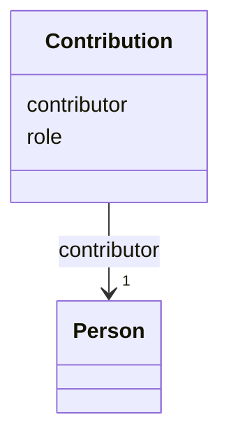

# Class: Contribution 


_Contributor role on a deliverable, CRediT-aligned where applicable._


URI: [sow:Contribution](https://w3id.org/collabri/sow/Contribution)





<!-- no inheritance hierarchy -->


## Slots

| Name | Cardinality and Range | Description | Inheritance |
| ---  | --- | --- | --- |
| [contributor](contributor.md) | 1 <br/> [Person](Person.md) |  | direct |
| [role](role.md) | 0..1 <br/> [String](String.md) | CRediT role IRI or local string | direct |


## Usages

| used by | used in | type | used |
| ---  | --- | --- | --- |
| [Deliverable](Deliverable.md) | [contributors](contributors.md) | range | [Contribution](Contribution.md) |
| [NarrativeDocument](NarrativeDocument.md) | [contributors](contributors.md) | range | [Contribution](Contribution.md) |
| [Software](Software.md) | [contributors](contributors.md) | range | [Contribution](Contribution.md) |
| [Data](Data.md) | [contributors](contributors.md) | range | [Contribution](Contribution.md) |
| [Standard](Standard.md) | [contributors](contributors.md) | range | [Contribution](Contribution.md) |
| [Method](Method.md) | [contributors](contributors.md) | range | [Contribution](Contribution.md) |
| [Activity](Activity.md) | [contributors](contributors.md) | range | [Contribution](Contribution.md) |


## Identifier and Mapping Information


### Schema Source


* from schema: https://w3id.org/collabri/sow


## Mappings

| Mapping Type | Mapped Value |
| ---  | ---  |
| self | sow:Contribution |
| native | sow:Contribution |


## LinkML Source

<!-- TODO: investigate https://stackoverflow.com/questions/37606292/how-to-create-tabbed-code-blocks-in-mkdocs-or-sphinx -->

### Direct

<details>
```yaml
name: Contribution
description: Contributor role on a deliverable, CRediT-aligned where applicable.
from_schema: https://w3id.org/collabri/sow
attributes:
  contributor:
    name: contributor
    from_schema: https://w3id.org/collabri/sow
    rank: 1000
    domain_of:
    - Contribution
    range: Person
    required: true
    inlined: true
  role:
    name: role
    description: CRediT role IRI or local string.
    from_schema: https://w3id.org/collabri/sow
    domain_of:
    - Party
    - Contribution

```
</details>

### Induced

<details>
```yaml
name: Contribution
description: Contributor role on a deliverable, CRediT-aligned where applicable.
from_schema: https://w3id.org/collabri/sow
attributes:
  contributor:
    name: contributor
    from_schema: https://w3id.org/collabri/sow
    rank: 1000
    alias: contributor
    owner: Contribution
    domain_of:
    - Contribution
    range: Person
    required: true
    inlined: true
  role:
    name: role
    description: CRediT role IRI or local string.
    from_schema: https://w3id.org/collabri/sow
    alias: role
    owner: Contribution
    domain_of:
    - Party
    - Contribution
    range: string

```
</details>