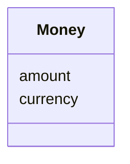

# Class: Money 


_Monetary amount with currency._


URI: [schema:MonetaryAmount](http://schema.org/MonetaryAmount)





<!-- no inheritance hierarchy -->


## Slots

| Name | Cardinality and Range | Description | Inheritance |
| ---  | --- | --- | --- |
| [amount](amount.md) | 1 <br/> [Decimal](Decimal.md) |  | direct |
| [currency](currency.md) | 0..1 <br/> [String](String.md) |  | direct |


## Usages

| used by | used in | type | used |
| ---  | --- | --- | --- |
| [TaskTeam](TaskTeam.md) | [contract_value](contract_value.md) | range | [Money](Money.md) |
| [Payment](Payment.md) | [planned_amount](planned_amount.md) | range | [Money](Money.md) |


## Identifier and Mapping Information


### Schema Source


* from schema: https://w3id.org/collabri/sow


## Mappings

| Mapping Type | Mapped Value |
| ---  | ---  |
| self | schema:MonetaryAmount |
| native | sow:Money |


## LinkML Source

<!-- TODO: investigate https://stackoverflow.com/questions/37606292/how-to-create-tabbed-code-blocks-in-mkdocs-or-sphinx -->

### Direct

<details>
```yaml
name: Money
description: Monetary amount with currency.
from_schema: https://w3id.org/collabri/sow
attributes:
  amount:
    name: amount
    from_schema: https://w3id.org/collabri/sow
    rank: 1000
    domain_of:
    - Money
    range: decimal
    required: true
  currency:
    name: currency
    from_schema: https://w3id.org/collabri/sow
    rank: 1000
    ifabsent: string(USD)
    domain_of:
    - Money
class_uri: schema:MonetaryAmount

```
</details>

### Induced

<details>
```yaml
name: Money
description: Monetary amount with currency.
from_schema: https://w3id.org/collabri/sow
attributes:
  amount:
    name: amount
    from_schema: https://w3id.org/collabri/sow
    rank: 1000
    alias: amount
    owner: Money
    domain_of:
    - Money
    range: decimal
    required: true
  currency:
    name: currency
    from_schema: https://w3id.org/collabri/sow
    rank: 1000
    ifabsent: string(USD)
    alias: currency
    owner: Money
    domain_of:
    - Money
    range: string
class_uri: schema:MonetaryAmount

```
</details>