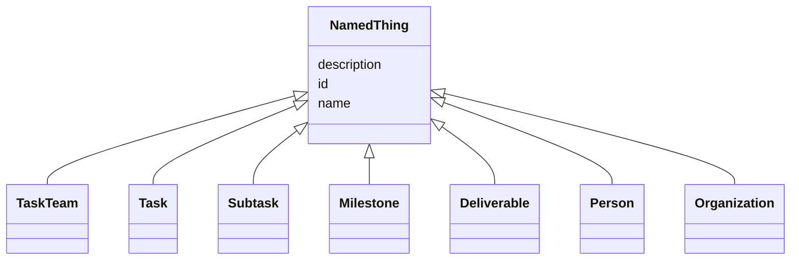

# Class: NamedThing 


_Base class for any addressable SOW element._


* __NOTE__: this is an abstract class and should not be instantiated directly


URI: [sow:NamedThing](https://w3id.org/collabri/sow/NamedThing)





## Inheritance
* **NamedThing**
    * [TaskTeam](TaskTeam.md) [ [Versioned](Versioned.md) [Trackable](Trackable.md)]
    * [Task](Task.md) [ [Versioned](Versioned.md) [Trackable](Trackable.md)]
    * [Subtask](Subtask.md) [ [Versioned](Versioned.md) [Trackable](Trackable.md)]
    * [Milestone](Milestone.md) [ [Versioned](Versioned.md) [Trackable](Trackable.md)]
    * [Deliverable](Deliverable.md) [ [Versioned](Versioned.md) [Trackable](Trackable.md)]
    * [Person](Person.md)
    * [Organization](Organization.md)


## Slots

| Name | Cardinality and Range | Description | Inheritance |
| ---  | --- | --- | --- |
| [id](id.md) | 1 <br/> [String](String.md) | Stable ID; together with version forms the element IRI | direct |
| [name](name.md) | 1 <br/> [String](String.md) |  | direct |
| [description](description.md) | 0..1 <br/> [String](String.md) |  | direct |


## Identifier and Mapping Information


### Schema Source


* from schema: https://w3id.org/collabri/sow


## Mappings

| Mapping Type | Mapped Value |
| ---  | ---  |
| self | sow:NamedThing |
| native | sow:NamedThing |


## LinkML Source

<!-- TODO: investigate https://stackoverflow.com/questions/37606292/how-to-create-tabbed-code-blocks-in-mkdocs-or-sphinx -->

### Direct

<details>
```yaml
name: NamedThing
description: Base class for any addressable SOW element.
from_schema: https://w3id.org/collabri/sow
abstract: true
attributes:
  id:
    name: id
    description: Stable ID; together with version forms the element IRI.
    from_schema: https://w3id.org/collabri/sow
    rank: 1000
    slot_uri: dcterms:identifier
    identifier: true
    domain_of:
    - NamedThing
    - Approval
    - ChangeProposal
    - Change
    required: true
  name:
    name: name
    from_schema: https://w3id.org/collabri/sow
    rank: 1000
    slot_uri: schema:name
    domain_of:
    - NamedThing
    required: true
  description:
    name: description
    from_schema: https://w3id.org/collabri/sow
    rank: 1000
    slot_uri: dcterms:description
    domain_of:
    - NamedThing

```
</details>

### Induced

<details>
```yaml
name: NamedThing
description: Base class for any addressable SOW element.
from_schema: https://w3id.org/collabri/sow
abstract: true
attributes:
  id:
    name: id
    description: Stable ID; together with version forms the element IRI.
    from_schema: https://w3id.org/collabri/sow
    rank: 1000
    slot_uri: dcterms:identifier
    identifier: true
    alias: id
    owner: NamedThing
    domain_of:
    - NamedThing
    - Approval
    - ChangeProposal
    - Change
    range: string
    required: true
  name:
    name: name
    from_schema: https://w3id.org/collabri/sow
    rank: 1000
    slot_uri: schema:name
    alias: name
    owner: NamedThing
    domain_of:
    - NamedThing
    range: string
    required: true
  description:
    name: description
    from_schema: https://w3id.org/collabri/sow
    rank: 1000
    slot_uri: dcterms:description
    alias: description
    owner: NamedThing
    domain_of:
    - NamedThing
    range: string

```
</details>