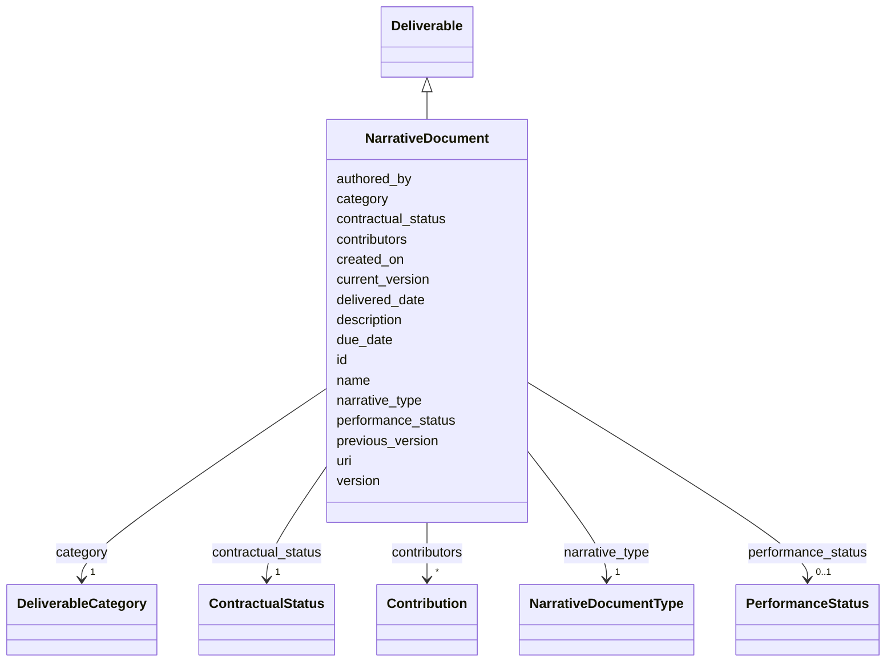

# Class: NarrativeDocument 


_Policy, SOP, report, recommendation, publication, progress-report blurb, etc._


URI: [fabio:Expression](http://purl.org/spar/fabio/Expression)





## Inheritance
* [NamedThing](NamedThing.md)
    * [Deliverable](Deliverable.md) [ [Versioned](Versioned.md) [Trackable](Trackable.md)]
        * **NarrativeDocument**


## Slots

| Name | Cardinality and Range | Description | Inheritance |
| ---  | --- | --- | --- |
| [narrative_type](narrative_type.md) | 1 <br/> [NarrativeDocumentType](NarrativeDocumentType.md) |  | direct |
| [category](category.md) | 1 <br/> [DeliverableCategory](DeliverableCategory.md) |  | [Deliverable](Deliverable.md) |
| [due_date](due_date.md) | 0..1 <br/> [Date](Date.md) |  | [Deliverable](Deliverable.md) |
| [delivered_date](delivered_date.md) | 0..1 <br/> [Date](Date.md) |  | [Deliverable](Deliverable.md) |
| [uri](uri.md) | 0..1 <br/> [uri](uri.md) |  | [Deliverable](Deliverable.md) |
| [contributors](contributors.md) | * <br/> [Contribution](Contribution.md) |  | [Deliverable](Deliverable.md) |
| [version](version.md) | 0..1 <br/> [String](String.md) | Semantic version of this element | [Versioned](Versioned.md) |
| [previous_version](previous_version.md) | 0..1 <br/> [Uriorcurie](Uriorcurie.md) | IRI of the immediately prior version of this element | [Versioned](Versioned.md) |
| [current_version](current_version.md) | 0..1 <br/> [Boolean](Boolean.md) | True iff this is the current accepted version of the element | [Versioned](Versioned.md) |
| [created_on](created_on.md) | 0..1 <br/> [Date](Date.md) |  | [Versioned](Versioned.md) |
| [authored_by](authored_by.md) | * <br/> [Uriorcurie](Uriorcurie.md) |  | [Versioned](Versioned.md) |
| [contractual_status](contractual_status.md) | 1 <br/> [ContractualStatus](ContractualStatus.md) |  | [Trackable](Trackable.md) |
| [performance_status](performance_status.md) | 0..1 <br/> [PerformanceStatus](PerformanceStatus.md) |  | [Trackable](Trackable.md) |
| [id](id.md) | 1 <br/> [String](String.md) | Stable ID; together with version forms the element IRI | [NamedThing](NamedThing.md) |
| [name](name.md) | 1 <br/> [String](String.md) |  | [NamedThing](NamedThing.md) |
| [description](description.md) | 0..1 <br/> [String](String.md) |  | [NamedThing](NamedThing.md) |


## Identifier and Mapping Information


### Schema Source


* from schema: https://w3id.org/collabri/sow


## Mappings

| Mapping Type | Mapped Value |
| ---  | ---  |
| self | fabio:Expression |
| native | sow:NarrativeDocument |


## LinkML Source

<!-- TODO: investigate https://stackoverflow.com/questions/37606292/how-to-create-tabbed-code-blocks-in-mkdocs-or-sphinx -->

### Direct

<details>
```yaml
name: NarrativeDocument
description: Policy, SOP, report, recommendation, publication, progress-report blurb,
  etc.
from_schema: https://w3id.org/collabri/sow
is_a: Deliverable
slot_usage:
  category:
    name: category
    ifabsent: string(narrative_document)
    equals_string: narrative_document
attributes:
  narrative_type:
    name: narrative_type
    from_schema: https://w3id.org/collabri/sow
    rank: 1000
    domain_of:
    - NarrativeDocument
    range: NarrativeDocumentType
    required: true
class_uri: fabio:Expression

```
</details>

### Induced

<details>
```yaml
name: NarrativeDocument
description: Policy, SOP, report, recommendation, publication, progress-report blurb,
  etc.
from_schema: https://w3id.org/collabri/sow
is_a: Deliverable
slot_usage:
  category:
    name: category
    ifabsent: string(narrative_document)
    equals_string: narrative_document
attributes:
  narrative_type:
    name: narrative_type
    from_schema: https://w3id.org/collabri/sow
    rank: 1000
    alias: narrative_type
    owner: NarrativeDocument
    domain_of:
    - NarrativeDocument
    range: NarrativeDocumentType
    required: true
  category:
    name: category
    from_schema: https://w3id.org/collabri/sow
    rank: 1000
    ifabsent: string(narrative_document)
    alias: category
    owner: NarrativeDocument
    domain_of:
    - Deliverable
    range: DeliverableCategory
    required: true
    equals_string: narrative_document
  due_date:
    name: due_date
    from_schema: https://w3id.org/collabri/sow
    rank: 1000
    alias: due_date
    owner: NarrativeDocument
    domain_of:
    - Deliverable
    range: date
  delivered_date:
    name: delivered_date
    from_schema: https://w3id.org/collabri/sow
    rank: 1000
    alias: delivered_date
    owner: NarrativeDocument
    domain_of:
    - Deliverable
    range: date
  uri:
    name: uri
    from_schema: https://w3id.org/collabri/sow
    rank: 1000
    slot_uri: dcat:landingPage
    alias: uri
    owner: NarrativeDocument
    domain_of:
    - Deliverable
    range: uri
  contributors:
    name: contributors
    from_schema: https://w3id.org/collabri/sow
    rank: 1000
    alias: contributors
    owner: NarrativeDocument
    domain_of:
    - Deliverable
    range: Contribution
    multivalued: true
    inlined: true
    inlined_as_list: true
  version:
    name: version
    description: Semantic version of this element.
    from_schema: https://w3id.org/collabri/sow
    rank: 1000
    slot_uri: pav:version
    alias: version
    owner: NarrativeDocument
    domain_of:
    - Versioned
    range: string
  previous_version:
    name: previous_version
    description: IRI of the immediately prior version of this element.
    from_schema: https://w3id.org/collabri/sow
    rank: 1000
    slot_uri: pav:previousVersion
    alias: previous_version
    owner: NarrativeDocument
    domain_of:
    - Versioned
    range: uriorcurie
  current_version:
    name: current_version
    description: True iff this is the current accepted version of the element.
    from_schema: https://w3id.org/collabri/sow
    rank: 1000
    slot_uri: pav:hasCurrentVersion
    alias: current_version
    owner: NarrativeDocument
    domain_of:
    - Versioned
    range: boolean
  created_on:
    name: created_on
    from_schema: https://w3id.org/collabri/sow
    rank: 1000
    slot_uri: pav:createdOn
    alias: created_on
    owner: NarrativeDocument
    domain_of:
    - Versioned
    range: date
  authored_by:
    name: authored_by
    from_schema: https://w3id.org/collabri/sow
    rank: 1000
    slot_uri: pav:authoredBy
    alias: authored_by
    owner: NarrativeDocument
    domain_of:
    - Versioned
    range: uriorcurie
    multivalued: true
  contractual_status:
    name: contractual_status
    from_schema: https://w3id.org/collabri/sow
    rank: 1000
    alias: contractual_status
    owner: NarrativeDocument
    domain_of:
    - Trackable
    range: ContractualStatus
    required: true
  performance_status:
    name: performance_status
    from_schema: https://w3id.org/collabri/sow
    rank: 1000
    alias: performance_status
    owner: NarrativeDocument
    domain_of:
    - Trackable
    range: PerformanceStatus
  id:
    name: id
    description: Stable ID; together with version forms the element IRI.
    from_schema: https://w3id.org/collabri/sow
    rank: 1000
    slot_uri: dcterms:identifier
    identifier: true
    alias: id
    owner: NarrativeDocument
    domain_of:
    - NamedThing
    - Approval
    - ChangeProposal
    - Change
    range: string
    required: true
  name:
    name: name
    from_schema: https://w3id.org/collabri/sow
    rank: 1000
    slot_uri: schema:name
    alias: name
    owner: NarrativeDocument
    domain_of:
    - NamedThing
    range: string
    required: true
  description:
    name: description
    from_schema: https://w3id.org/collabri/sow
    rank: 1000
    slot_uri: dcterms:description
    alias: description
    owner: NarrativeDocument
    domain_of:
    - NamedThing
    range: string
class_uri: fabio:Expression

```
</details>