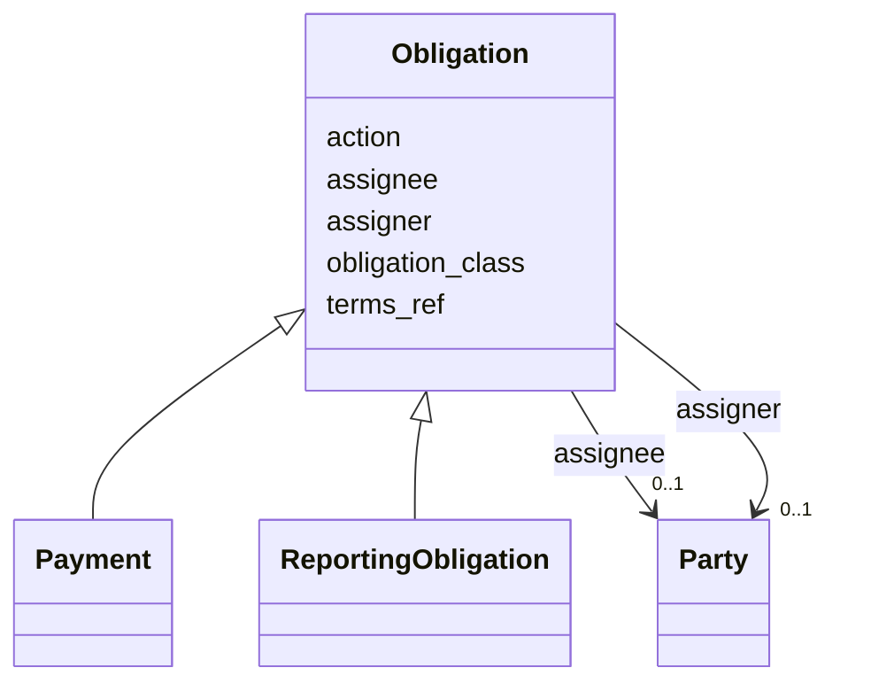

# Class: Obligation 


_Abstract base for any contractual duty (ODRL pattern). Concrete subclasses include Payment, ReportingObligation, DataRightsObligation, etc. Subclass as needed without restructuring the schema._


* __NOTE__: this is an abstract class and should not be instantiated directly


URI: [odrl:Duty](http://www.w3.org/ns/odrl/2/Duty)





## Inheritance
* **Obligation**
    * [Payment](Payment.md)
    * [ReportingObligation](ReportingObligation.md)


## Slots

| Name | Cardinality and Range | Description | Inheritance |
| ---  | --- | --- | --- |
| [obligation_class](obligation_class.md) | 0..1 <br/> [String](String.md) | Discriminator for the concrete Obligation subclass | direct |
| [assigner](assigner.md) | 0..1 <br/> [Party](Party.md) | Party imposing the obligation | direct |
| [assignee](assignee.md) | 0..1 <br/> [Party](Party.md) | Party bound by the obligation | direct |
| [action](action.md) | 0..1 <br/> [String](String.md) | ODRL action term or local action label (e | direct |
| [terms_ref](terms_ref.md) | 0..1 <br/> [uri](uri.md) | Pointer to the governing contract clause | direct |


## Usages

| used by | used in | type | used |
| ---  | --- | --- | --- |
| [TaskTeam](TaskTeam.md) | [obligations](obligations.md) | range | [Obligation](Obligation.md) |


## Identifier and Mapping Information


### Schema Source


* from schema: https://w3id.org/collabri/sow


## Mappings

| Mapping Type | Mapped Value |
| ---  | ---  |
| self | odrl:Duty |
| native | sow:Obligation |
| close | fibo_ctr:ContractualCommitment, lrml:Obligation |


## LinkML Source

<!-- TODO: investigate https://stackoverflow.com/questions/37606292/how-to-create-tabbed-code-blocks-in-mkdocs-or-sphinx -->

### Direct

<details>
```yaml
name: Obligation
description: Abstract base for any contractual duty (ODRL pattern). Concrete subclasses
  include Payment, ReportingObligation, DataRightsObligation, etc. Subclass as needed
  without restructuring the schema.
from_schema: https://w3id.org/collabri/sow
close_mappings:
- fibo_ctr:ContractualCommitment
- lrml:Obligation
abstract: true
attributes:
  obligation_class:
    name: obligation_class
    description: Discriminator for the concrete Obligation subclass. Auto-set by subclasses;
      instance YAML should set this to the subclass name (e.g., Payment, ReportingObligation).
    from_schema: https://w3id.org/collabri/sow
    rank: 1000
    designates_type: true
    domain_of:
    - Obligation
  assigner:
    name: assigner
    description: Party imposing the obligation.
    from_schema: https://w3id.org/collabri/sow
    rank: 1000
    slot_uri: odrl:assigner
    domain_of:
    - Obligation
    range: Party
    inlined: true
  assignee:
    name: assignee
    description: Party bound by the obligation.
    from_schema: https://w3id.org/collabri/sow
    rank: 1000
    slot_uri: odrl:assignee
    domain_of:
    - Obligation
    range: Party
    inlined: true
  action:
    name: action
    description: ODRL action term or local action label (e.g., compensate, report).
    from_schema: https://w3id.org/collabri/sow
    rank: 1000
    slot_uri: odrl:action
    domain_of:
    - Obligation
  terms_ref:
    name: terms_ref
    description: Pointer to the governing contract clause.
    from_schema: https://w3id.org/collabri/sow
    rank: 1000
    domain_of:
    - Obligation
    range: uri
class_uri: odrl:Duty

```
</details>

### Induced

<details>
```yaml
name: Obligation
description: Abstract base for any contractual duty (ODRL pattern). Concrete subclasses
  include Payment, ReportingObligation, DataRightsObligation, etc. Subclass as needed
  without restructuring the schema.
from_schema: https://w3id.org/collabri/sow
close_mappings:
- fibo_ctr:ContractualCommitment
- lrml:Obligation
abstract: true
attributes:
  obligation_class:
    name: obligation_class
    description: Discriminator for the concrete Obligation subclass. Auto-set by subclasses;
      instance YAML should set this to the subclass name (e.g., Payment, ReportingObligation).
    from_schema: https://w3id.org/collabri/sow
    rank: 1000
    designates_type: true
    alias: obligation_class
    owner: Obligation
    domain_of:
    - Obligation
    range: string
  assigner:
    name: assigner
    description: Party imposing the obligation.
    from_schema: https://w3id.org/collabri/sow
    rank: 1000
    slot_uri: odrl:assigner
    alias: assigner
    owner: Obligation
    domain_of:
    - Obligation
    range: Party
    inlined: true
  assignee:
    name: assignee
    description: Party bound by the obligation.
    from_schema: https://w3id.org/collabri/sow
    rank: 1000
    slot_uri: odrl:assignee
    alias: assignee
    owner: Obligation
    domain_of:
    - Obligation
    range: Party
    inlined: true
  action:
    name: action
    description: ODRL action term or local action label (e.g., compensate, report).
    from_schema: https://w3id.org/collabri/sow
    rank: 1000
    slot_uri: odrl:action
    alias: action
    owner: Obligation
    domain_of:
    - Obligation
    range: string
  terms_ref:
    name: terms_ref
    description: Pointer to the governing contract clause.
    from_schema: https://w3id.org/collabri/sow
    rank: 1000
    alias: terms_ref
    owner: Obligation
    domain_of:
    - Obligation
    range: uri
class_uri: odrl:Duty

```
</details>