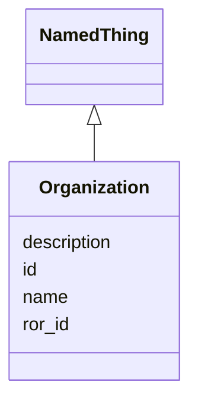

# Class: Organization 


URI: [org:Organization](http://www.w3.org/ns/org#Organization)





## Inheritance
* [NamedThing](NamedThing.md)
    * **Organization**


## Slots

| Name | Cardinality and Range | Description | Inheritance |
| ---  | --- | --- | --- |
| [ror_id](ror_id.md) | 0..1 <br/> [uri](uri.md) |  | direct |
| [id](id.md) | 1 <br/> [String](String.md) | Stable ID; together with version forms the element IRI | [NamedThing](NamedThing.md) |
| [name](name.md) | 1 <br/> [String](String.md) |  | [NamedThing](NamedThing.md) |
| [description](description.md) | 0..1 <br/> [String](String.md) |  | [NamedThing](NamedThing.md) |


## Usages

| used by | used in | type | used |
| ---  | --- | --- | --- |
| [TaskTeam](TaskTeam.md) | [sponsor](sponsor.md) | range | [Organization](Organization.md) |
| [TaskTeam](TaskTeam.md) | [prime](prime.md) | range | [Organization](Organization.md) |
| [Party](Party.md) | [agent](agent.md) | range | [Organization](Organization.md) |


## Identifier and Mapping Information


### Schema Source


* from schema: https://w3id.org/collabri/sow


## Mappings

| Mapping Type | Mapped Value |
| ---  | ---  |
| self | org:Organization |
| native | sow:Organization |


## LinkML Source

<!-- TODO: investigate https://stackoverflow.com/questions/37606292/how-to-create-tabbed-code-blocks-in-mkdocs-or-sphinx -->

### Direct

<details>
```yaml
name: Organization
from_schema: https://w3id.org/collabri/sow
is_a: NamedThing
attributes:
  ror_id:
    name: ror_id
    from_schema: https://w3id.org/collabri/sow
    rank: 1000
    domain_of:
    - Organization
    range: uri
class_uri: org:Organization

```
</details>

### Induced

<details>
```yaml
name: Organization
from_schema: https://w3id.org/collabri/sow
is_a: NamedThing
attributes:
  ror_id:
    name: ror_id
    from_schema: https://w3id.org/collabri/sow
    rank: 1000
    alias: ror_id
    owner: Organization
    domain_of:
    - Organization
    range: uri
  id:
    name: id
    description: Stable ID; together with version forms the element IRI.
    from_schema: https://w3id.org/collabri/sow
    rank: 1000
    slot_uri: dcterms:identifier
    identifier: true
    alias: id
    owner: Organization
    domain_of:
    - NamedThing
    - Approval
    - ChangeProposal
    - Change
    range: string
    required: true
  name:
    name: name
    from_schema: https://w3id.org/collabri/sow
    rank: 1000
    slot_uri: schema:name
    alias: name
    owner: Organization
    domain_of:
    - NamedThing
    range: string
    required: true
  description:
    name: description
    from_schema: https://w3id.org/collabri/sow
    rank: 1000
    slot_uri: dcterms:description
    alias: description
    owner: Organization
    domain_of:
    - NamedThing
    range: string
class_uri: org:Organization

```
</details>