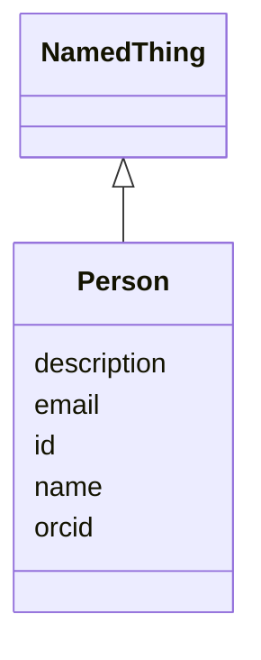

# Class: Person 


URI: [foaf:Person](http://xmlns.com/foaf/0.1/Person)





## Inheritance
* [NamedThing](NamedThing.md)
    * **Person**


## Slots

| Name | Cardinality and Range | Description | Inheritance |
| ---  | --- | --- | --- |
| [orcid](orcid.md) | 0..1 <br/> [uri](uri.md) |  | direct |
| [email](email.md) | 0..1 <br/> [String](String.md) |  | direct |
| [id](id.md) | 1 <br/> [String](String.md) | Stable ID; together with version forms the element IRI | [NamedThing](NamedThing.md) |
| [name](name.md) | 1 <br/> [String](String.md) |  | [NamedThing](NamedThing.md) |
| [description](description.md) | 0..1 <br/> [String](String.md) |  | [NamedThing](NamedThing.md) |


## Usages

| used by | used in | type | used |
| ---  | --- | --- | --- |
| [TaskTeam](TaskTeam.md) | [lead](lead.md) | range | [Person](Person.md) |
| [TaskTeam](TaskTeam.md) | [members](members.md) | range | [Person](Person.md) |
| [Contribution](Contribution.md) | [contributor](contributor.md) | range | [Person](Person.md) |
| [Approval](Approval.md) | [approver](approver.md) | range | [Person](Person.md) |
| [ChangeProposal](ChangeProposal.md) | [proposed_by](proposed_by.md) | range | [Person](Person.md) |


## Identifier and Mapping Information


### Schema Source


* from schema: https://w3id.org/collabri/sow


## Mappings

| Mapping Type | Mapped Value |
| ---  | ---  |
| self | foaf:Person |
| native | sow:Person |


## LinkML Source

<!-- TODO: investigate https://stackoverflow.com/questions/37606292/how-to-create-tabbed-code-blocks-in-mkdocs-or-sphinx -->

### Direct

<details>
```yaml
name: Person
from_schema: https://w3id.org/collabri/sow
is_a: NamedThing
attributes:
  orcid:
    name: orcid
    from_schema: https://w3id.org/collabri/sow
    rank: 1000
    domain_of:
    - Person
    range: uri
  email:
    name: email
    from_schema: https://w3id.org/collabri/sow
    rank: 1000
    domain_of:
    - Person
class_uri: foaf:Person

```
</details>

### Induced

<details>
```yaml
name: Person
from_schema: https://w3id.org/collabri/sow
is_a: NamedThing
attributes:
  orcid:
    name: orcid
    from_schema: https://w3id.org/collabri/sow
    rank: 1000
    alias: orcid
    owner: Person
    domain_of:
    - Person
    range: uri
  email:
    name: email
    from_schema: https://w3id.org/collabri/sow
    rank: 1000
    alias: email
    owner: Person
    domain_of:
    - Person
    range: string
  id:
    name: id
    description: Stable ID; together with version forms the element IRI.
    from_schema: https://w3id.org/collabri/sow
    rank: 1000
    slot_uri: dcterms:identifier
    identifier: true
    alias: id
    owner: Person
    domain_of:
    - NamedThing
    - Approval
    - ChangeProposal
    - Change
    range: string
    required: true
  name:
    name: name
    from_schema: https://w3id.org/collabri/sow
    rank: 1000
    slot_uri: schema:name
    alias: name
    owner: Person
    domain_of:
    - NamedThing
    range: string
    required: true
  description:
    name: description
    from_schema: https://w3id.org/collabri/sow
    rank: 1000
    slot_uri: dcterms:description
    alias: description
    owner: Person
    domain_of:
    - NamedThing
    range: string
class_uri: foaf:Person

```
</details>