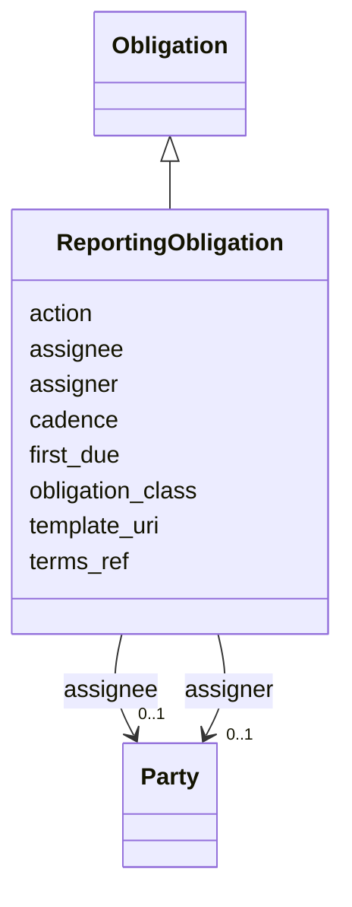

# Class: ReportingObligation 


_Recurring reporting duty (quarterly progress report, annual technical report, financial report, etc.). Attached to a TaskTeam._


URI: [sow:ReportingObligation](https://w3id.org/collabri/sow/ReportingObligation)





## Inheritance
* [Obligation](Obligation.md)
    * **ReportingObligation**


## Slots

| Name | Cardinality and Range | Description | Inheritance |
| ---  | --- | --- | --- |
| [cadence](cadence.md) | 0..1 <br/> [String](String.md) | Reporting cadence (e | direct |
| [first_due](first_due.md) | 0..1 <br/> [Date](Date.md) |  | direct |
| [template_uri](template_uri.md) | 0..1 <br/> [uri](uri.md) | Pointer to the required reporting template, if any | direct |
| [obligation_class](obligation_class.md) | 0..1 <br/> [String](String.md) | Discriminator for the concrete Obligation subclass | [Obligation](Obligation.md) |
| [assigner](assigner.md) | 0..1 <br/> [Party](Party.md) | Party imposing the obligation | [Obligation](Obligation.md) |
| [assignee](assignee.md) | 0..1 <br/> [Party](Party.md) | Party bound by the obligation | [Obligation](Obligation.md) |
| [action](action.md) | 0..1 <br/> [String](String.md) | ODRL action term or local action label (e | [Obligation](Obligation.md) |
| [terms_ref](terms_ref.md) | 0..1 <br/> [uri](uri.md) | Pointer to the governing contract clause | [Obligation](Obligation.md) |


## Identifier and Mapping Information


### Schema Source


* from schema: https://w3id.org/collabri/sow


## Mappings

| Mapping Type | Mapped Value |
| ---  | ---  |
| self | sow:ReportingObligation |
| native | sow:ReportingObligation |


## LinkML Source

<!-- TODO: investigate https://stackoverflow.com/questions/37606292/how-to-create-tabbed-code-blocks-in-mkdocs-or-sphinx -->

### Direct

<details>
```yaml
name: ReportingObligation
description: Recurring reporting duty (quarterly progress report, annual technical
  report, financial report, etc.). Attached to a TaskTeam.
from_schema: https://w3id.org/collabri/sow
is_a: Obligation
slot_usage:
  action:
    name: action
    ifabsent: string(report)
attributes:
  cadence:
    name: cadence
    description: Reporting cadence (e.g., quarterly, annual, ad-hoc).
    from_schema: https://w3id.org/collabri/sow
    rank: 1000
    domain_of:
    - ReportingObligation
  first_due:
    name: first_due
    from_schema: https://w3id.org/collabri/sow
    rank: 1000
    domain_of:
    - ReportingObligation
    range: date
  template_uri:
    name: template_uri
    description: Pointer to the required reporting template, if any.
    from_schema: https://w3id.org/collabri/sow
    rank: 1000
    domain_of:
    - ReportingObligation
    range: uri

```
</details>

### Induced

<details>
```yaml
name: ReportingObligation
description: Recurring reporting duty (quarterly progress report, annual technical
  report, financial report, etc.). Attached to a TaskTeam.
from_schema: https://w3id.org/collabri/sow
is_a: Obligation
slot_usage:
  action:
    name: action
    ifabsent: string(report)
attributes:
  cadence:
    name: cadence
    description: Reporting cadence (e.g., quarterly, annual, ad-hoc).
    from_schema: https://w3id.org/collabri/sow
    rank: 1000
    alias: cadence
    owner: ReportingObligation
    domain_of:
    - ReportingObligation
    range: string
  first_due:
    name: first_due
    from_schema: https://w3id.org/collabri/sow
    rank: 1000
    alias: first_due
    owner: ReportingObligation
    domain_of:
    - ReportingObligation
    range: date
  template_uri:
    name: template_uri
    description: Pointer to the required reporting template, if any.
    from_schema: https://w3id.org/collabri/sow
    rank: 1000
    alias: template_uri
    owner: ReportingObligation
    domain_of:
    - ReportingObligation
    range: uri
  obligation_class:
    name: obligation_class
    description: Discriminator for the concrete Obligation subclass. Auto-set by subclasses;
      instance YAML should set this to the subclass name (e.g., Payment, ReportingObligation).
    from_schema: https://w3id.org/collabri/sow
    rank: 1000
    designates_type: true
    alias: obligation_class
    owner: ReportingObligation
    domain_of:
    - Obligation
    range: string
  assigner:
    name: assigner
    description: Party imposing the obligation.
    from_schema: https://w3id.org/collabri/sow
    rank: 1000
    slot_uri: odrl:assigner
    alias: assigner
    owner: ReportingObligation
    domain_of:
    - Obligation
    range: Party
    inlined: true
  assignee:
    name: assignee
    description: Party bound by the obligation.
    from_schema: https://w3id.org/collabri/sow
    rank: 1000
    slot_uri: odrl:assignee
    alias: assignee
    owner: ReportingObligation
    domain_of:
    - Obligation
    range: Party
    inlined: true
  action:
    name: action
    description: ODRL action term or local action label (e.g., compensate, report).
    from_schema: https://w3id.org/collabri/sow
    rank: 1000
    slot_uri: odrl:action
    ifabsent: string(report)
    alias: action
    owner: ReportingObligation
    domain_of:
    - Obligation
    range: string
  terms_ref:
    name: terms_ref
    description: Pointer to the governing contract clause.
    from_schema: https://w3id.org/collabri/sow
    rank: 1000
    alias: terms_ref
    owner: ReportingObligation
    domain_of:
    - Obligation
    range: uri

```
</details>