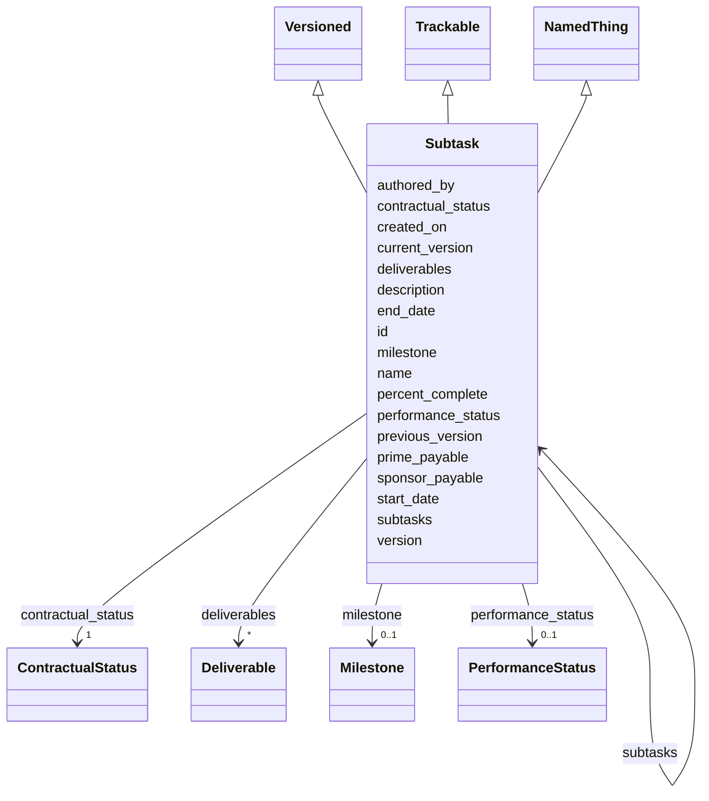

# Class: Subtask 


_A step toward completion of a Task. Subtasks nest recursively to arbitrary depth and are owned by exactly one TaskTeam (no shared ownership). Each subtask may be sponsor- and/or prime-payable; payment is triggered by acceptance of the referenced Milestone._


URI: [frapo:Task](http://purl.org/cerif/frapo/Task)





## Inheritance
* [NamedThing](NamedThing.md)
    * **Subtask** [ [Versioned](Versioned.md) [Trackable](Trackable.md)]


## Slots

| Name | Cardinality and Range | Description | Inheritance |
| ---  | --- | --- | --- |
| [subtasks](subtasks.md) | * <br/> [Subtask](Subtask.md) | Nested subtasks (arbitrary depth) | direct |
| [start_date](start_date.md) | 0..1 <br/> [Date](Date.md) |  | direct |
| [end_date](end_date.md) | 0..1 <br/> [Date](Date.md) |  | direct |
| [percent_complete](percent_complete.md) | 0..1 <br/> [Float](Float.md) | For partial-completion payable subtasks (e | direct |
| [sponsor_payable](sponsor_payable.md) | 1 <br/> [Boolean](Boolean.md) |  | direct |
| [prime_payable](prime_payable.md) | 1 <br/> [Boolean](Boolean.md) |  | direct |
| [milestone](milestone.md) | 0..1 <br/> [Milestone](Milestone.md) | Milestone whose acceptance gates contractual events for this subtask | direct |
| [deliverables](deliverables.md) | * <br/> [Deliverable](Deliverable.md) | Deliverables produced by this subtask | direct |
| [version](version.md) | 0..1 <br/> [String](String.md) | Semantic version of this element | [Versioned](Versioned.md) |
| [previous_version](previous_version.md) | 0..1 <br/> [Uriorcurie](Uriorcurie.md) | IRI of the immediately prior version of this element | [Versioned](Versioned.md) |
| [current_version](current_version.md) | 0..1 <br/> [Boolean](Boolean.md) | True iff this is the current accepted version of the element | [Versioned](Versioned.md) |
| [created_on](created_on.md) | 0..1 <br/> [Date](Date.md) |  | [Versioned](Versioned.md) |
| [authored_by](authored_by.md) | * <br/> [Uriorcurie](Uriorcurie.md) |  | [Versioned](Versioned.md) |
| [contractual_status](contractual_status.md) | 1 <br/> [ContractualStatus](ContractualStatus.md) |  | [Trackable](Trackable.md) |
| [performance_status](performance_status.md) | 0..1 <br/> [PerformanceStatus](PerformanceStatus.md) |  | [Trackable](Trackable.md) |
| [id](id.md) | 1 <br/> [String](String.md) | Stable ID; together with version forms the element IRI | [NamedThing](NamedThing.md) |
| [name](name.md) | 1 <br/> [String](String.md) |  | [NamedThing](NamedThing.md) |
| [description](description.md) | 0..1 <br/> [String](String.md) |  | [NamedThing](NamedThing.md) |


## Usages

| used by | used in | type | used |
| ---  | --- | --- | --- |
| [Task](Task.md) | [subtasks](subtasks.md) | range | [Subtask](Subtask.md) |
| [Subtask](Subtask.md) | [subtasks](subtasks.md) | range | [Subtask](Subtask.md) |


## Rules


### 

| Rule Applied | Preconditions | Postconditions | Elseconditions |
|--------------|---------------|----------------|----------------|
| any_of |```[{'slot_conditions': {'sponsor_payable': {'equals_string': 'true'}}}, {'slot_conditions': {'prime_payable': {'equals_string': 'true'}}}]``` | | |


## Identifier and Mapping Information


### Schema Source


* from schema: https://w3id.org/collabri/sow


## Mappings

| Mapping Type | Mapped Value |
| ---  | ---  |
| self | frapo:Task |
| native | sow:Subtask |


## LinkML Source

<!-- TODO: investigate https://stackoverflow.com/questions/37606292/how-to-create-tabbed-code-blocks-in-mkdocs-or-sphinx -->

### Direct

<details>
```yaml
name: Subtask
description: A step toward completion of a Task. Subtasks nest recursively to arbitrary
  depth and are owned by exactly one TaskTeam (no shared ownership). Each subtask
  may be sponsor- and/or prime-payable; payment is triggered by acceptance of the
  referenced Milestone.
from_schema: https://w3id.org/collabri/sow
is_a: NamedThing
mixins:
- Versioned
- Trackable
attributes:
  subtasks:
    name: subtasks
    description: Nested subtasks (arbitrary depth).
    from_schema: https://w3id.org/collabri/sow
    domain_of:
    - Task
    - Subtask
    range: Subtask
    multivalued: true
    inlined: true
    inlined_as_list: true
  start_date:
    name: start_date
    from_schema: https://w3id.org/collabri/sow
    domain_of:
    - Task
    - Subtask
    range: date
  end_date:
    name: end_date
    from_schema: https://w3id.org/collabri/sow
    domain_of:
    - Task
    - Subtask
    range: date
  percent_complete:
    name: percent_complete
    description: For partial-completion payable subtasks (e.g., reports paid in stages),
      the current percent complete against the subtask's scope.
    from_schema: https://w3id.org/collabri/sow
    rank: 1000
    domain_of:
    - Subtask
    range: float
    minimum_value: 0
    maximum_value: 100
  sponsor_payable:
    name: sponsor_payable
    from_schema: https://w3id.org/collabri/sow
    rank: 1000
    domain_of:
    - Subtask
    range: boolean
    required: true
  prime_payable:
    name: prime_payable
    from_schema: https://w3id.org/collabri/sow
    rank: 1000
    domain_of:
    - Subtask
    range: boolean
    required: true
  milestone:
    name: milestone
    description: Milestone whose acceptance gates contractual events for this subtask.
      Referenced by ID; the milestone itself is defined at the TaskTeam level.
    from_schema: https://w3id.org/collabri/sow
    rank: 1000
    domain_of:
    - Subtask
    range: Milestone
  deliverables:
    name: deliverables
    description: Deliverables produced by this subtask. A deliverable belongs to exactly
      one subtask. Required when sponsor- or prime-payable.
    from_schema: https://w3id.org/collabri/sow
    rank: 1000
    domain_of:
    - Subtask
    range: Deliverable
    multivalued: true
    inlined: true
    inlined_as_list: true
class_uri: frapo:Task
rules:
- preconditions:
    any_of:
    - slot_conditions:
        sponsor_payable:
          name: sponsor_payable
          equals_string: 'true'
    - slot_conditions:
        prime_payable:
          name: prime_payable
          equals_string: 'true'
  postconditions:
    slot_conditions:
      deliverables:
        name: deliverables
        required: true
  description: Any sponsor- or prime-payable subtask must have at least one deliverable.
    (The convention that at least one of those is a progress-report narrative document
    is documented but not machine-enforced here.)

```
</details>

### Induced

<details>
```yaml
name: Subtask
description: A step toward completion of a Task. Subtasks nest recursively to arbitrary
  depth and are owned by exactly one TaskTeam (no shared ownership). Each subtask
  may be sponsor- and/or prime-payable; payment is triggered by acceptance of the
  referenced Milestone.
from_schema: https://w3id.org/collabri/sow
is_a: NamedThing
mixins:
- Versioned
- Trackable
attributes:
  subtasks:
    name: subtasks
    description: Nested subtasks (arbitrary depth).
    from_schema: https://w3id.org/collabri/sow
    alias: subtasks
    owner: Subtask
    domain_of:
    - Task
    - Subtask
    range: Subtask
    multivalued: true
    inlined: true
    inlined_as_list: true
  start_date:
    name: start_date
    from_schema: https://w3id.org/collabri/sow
    alias: start_date
    owner: Subtask
    domain_of:
    - Task
    - Subtask
    range: date
  end_date:
    name: end_date
    from_schema: https://w3id.org/collabri/sow
    alias: end_date
    owner: Subtask
    domain_of:
    - Task
    - Subtask
    range: date
  percent_complete:
    name: percent_complete
    description: For partial-completion payable subtasks (e.g., reports paid in stages),
      the current percent complete against the subtask's scope.
    from_schema: https://w3id.org/collabri/sow
    rank: 1000
    alias: percent_complete
    owner: Subtask
    domain_of:
    - Subtask
    range: float
    minimum_value: 0
    maximum_value: 100
  sponsor_payable:
    name: sponsor_payable
    from_schema: https://w3id.org/collabri/sow
    rank: 1000
    alias: sponsor_payable
    owner: Subtask
    domain_of:
    - Subtask
    range: boolean
    required: true
  prime_payable:
    name: prime_payable
    from_schema: https://w3id.org/collabri/sow
    rank: 1000
    alias: prime_payable
    owner: Subtask
    domain_of:
    - Subtask
    range: boolean
    required: true
  milestone:
    name: milestone
    description: Milestone whose acceptance gates contractual events for this subtask.
      Referenced by ID; the milestone itself is defined at the TaskTeam level.
    from_schema: https://w3id.org/collabri/sow
    rank: 1000
    alias: milestone
    owner: Subtask
    domain_of:
    - Subtask
    range: Milestone
  deliverables:
    name: deliverables
    description: Deliverables produced by this subtask. A deliverable belongs to exactly
      one subtask. Required when sponsor- or prime-payable.
    from_schema: https://w3id.org/collabri/sow
    rank: 1000
    alias: deliverables
    owner: Subtask
    domain_of:
    - Subtask
    range: Deliverable
    multivalued: true
    inlined: true
    inlined_as_list: true
  version:
    name: version
    description: Semantic version of this element.
    from_schema: https://w3id.org/collabri/sow
    rank: 1000
    slot_uri: pav:version
    alias: version
    owner: Subtask
    domain_of:
    - Versioned
    range: string
  previous_version:
    name: previous_version
    description: IRI of the immediately prior version of this element.
    from_schema: https://w3id.org/collabri/sow
    rank: 1000
    slot_uri: pav:previousVersion
    alias: previous_version
    owner: Subtask
    domain_of:
    - Versioned
    range: uriorcurie
  current_version:
    name: current_version
    description: True iff this is the current accepted version of the element.
    from_schema: https://w3id.org/collabri/sow
    rank: 1000
    slot_uri: pav:hasCurrentVersion
    alias: current_version
    owner: Subtask
    domain_of:
    - Versioned
    range: boolean
  created_on:
    name: created_on
    from_schema: https://w3id.org/collabri/sow
    rank: 1000
    slot_uri: pav:createdOn
    alias: created_on
    owner: Subtask
    domain_of:
    - Versioned
    range: date
  authored_by:
    name: authored_by
    from_schema: https://w3id.org/collabri/sow
    rank: 1000
    slot_uri: pav:authoredBy
    alias: authored_by
    owner: Subtask
    domain_of:
    - Versioned
    range: uriorcurie
    multivalued: true
  contractual_status:
    name: contractual_status
    from_schema: https://w3id.org/collabri/sow
    rank: 1000
    alias: contractual_status
    owner: Subtask
    domain_of:
    - Trackable
    range: ContractualStatus
    required: true
  performance_status:
    name: performance_status
    from_schema: https://w3id.org/collabri/sow
    rank: 1000
    alias: performance_status
    owner: Subtask
    domain_of:
    - Trackable
    range: PerformanceStatus
  id:
    name: id
    description: Stable ID; together with version forms the element IRI.
    from_schema: https://w3id.org/collabri/sow
    rank: 1000
    slot_uri: dcterms:identifier
    identifier: true
    alias: id
    owner: Subtask
    domain_of:
    - NamedThing
    - Approval
    - ChangeProposal
    - Change
    range: string
    required: true
  name:
    name: name
    from_schema: https://w3id.org/collabri/sow
    rank: 1000
    slot_uri: schema:name
    alias: name
    owner: Subtask
    domain_of:
    - NamedThing
    range: string
    required: true
  description:
    name: description
    from_schema: https://w3id.org/collabri/sow
    rank: 1000
    slot_uri: dcterms:description
    alias: description
    owner: Subtask
    domain_of:
    - NamedThing
    range: string
class_uri: frapo:Task
rules:
- preconditions:
    any_of:
    - slot_conditions:
        sponsor_payable:
          name: sponsor_payable
          equals_string: 'true'
    - slot_conditions:
        prime_payable:
          name: prime_payable
          equals_string: 'true'
  postconditions:
    slot_conditions:
      deliverables:
        name: deliverables
        required: true
  description: Any sponsor- or prime-payable subtask must have at least one deliverable.
    (The convention that at least one of those is a progress-report narrative document
    is documented but not machine-enforced here.)

```
</details>