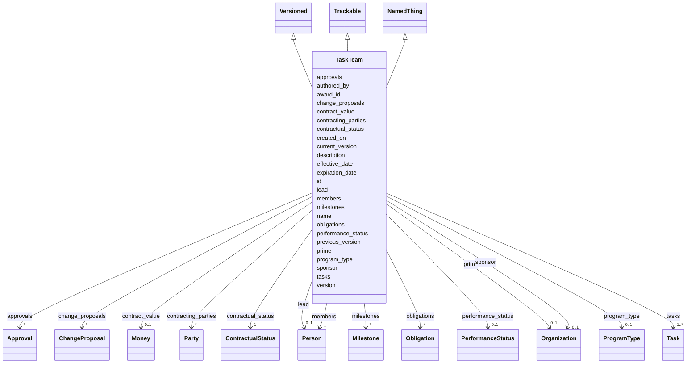

# Class: TaskTeam 


_Root of a SOW. A TaskTeam in this schema is the contract-scoped unit: the same conceptual team may exist across multiple programs, but each contracted engagement gets its own TaskTeam instance. Modeled as both a FIBO Contract and an ODRL Agreement so obligations can be attached directly via the standard ODRL pattern._


URI: [fibo_ctr:Contract](https://spec.edmcouncil.org/fibo/ontology/FND/Agreements/Contracts/Contract)





## Inheritance
* [NamedThing](NamedThing.md)
    * **TaskTeam** [ [Versioned](Versioned.md) [Trackable](Trackable.md)]


## Slots

| Name | Cardinality and Range | Description | Inheritance |
| ---  | --- | --- | --- |
| [program_type](program_type.md) | 0..1 <br/> [ProgramType](ProgramType.md) |  | direct |
| [award_id](award_id.md) | 0..1 <br/> [String](String.md) | Sponsor award or contract identifier | direct |
| [effective_date](effective_date.md) | 0..1 <br/> [Date](Date.md) |  | direct |
| [expiration_date](expiration_date.md) | 0..1 <br/> [Date](Date.md) |  | direct |
| [sponsor](sponsor.md) | 0..1 <br/> [Organization](Organization.md) |  | direct |
| [prime](prime.md) | 0..1 <br/> [Organization](Organization.md) | Prime contractor under this contract | direct |
| [contracting_parties](contracting_parties.md) | * <br/> [Party](Party.md) | All parties to the contract with their roles | direct |
| [lead](lead.md) | 0..1 <br/> [Person](Person.md) |  | direct |
| [members](members.md) | * <br/> [Person](Person.md) |  | direct |
| [contract_value](contract_value.md) | 0..1 <br/> [Money](Money.md) |  | direct |
| [tasks](tasks.md) | 1..* <br/> [Task](Task.md) |  | direct |
| [milestones](milestones.md) | * <br/> [Milestone](Milestone.md) | Milestones for this SOW | direct |
| [change_proposals](change_proposals.md) | * <br/> [ChangeProposal](ChangeProposal.md) | Open and historical proposals against this SOW | direct |
| [approvals](approvals.md) | * <br/> [Approval](Approval.md) | Signoffs against versions of SOW elements | direct |
| [obligations](obligations.md) | * <br/> [Obligation](Obligation.md) | Non-payment obligations attached at the agreement level (reporting cadence, d... | direct |
| [version](version.md) | 0..1 <br/> [String](String.md) | Semantic version of this element | [Versioned](Versioned.md) |
| [previous_version](previous_version.md) | 0..1 <br/> [Uriorcurie](Uriorcurie.md) | IRI of the immediately prior version of this element | [Versioned](Versioned.md) |
| [current_version](current_version.md) | 0..1 <br/> [Boolean](Boolean.md) | True iff this is the current accepted version of the element | [Versioned](Versioned.md) |
| [created_on](created_on.md) | 0..1 <br/> [Date](Date.md) |  | [Versioned](Versioned.md) |
| [authored_by](authored_by.md) | * <br/> [Uriorcurie](Uriorcurie.md) |  | [Versioned](Versioned.md) |
| [contractual_status](contractual_status.md) | 1 <br/> [ContractualStatus](ContractualStatus.md) |  | [Trackable](Trackable.md) |
| [performance_status](performance_status.md) | 0..1 <br/> [PerformanceStatus](PerformanceStatus.md) |  | [Trackable](Trackable.md) |
| [id](id.md) | 1 <br/> [String](String.md) | Stable ID; together with version forms the element IRI | [NamedThing](NamedThing.md) |
| [name](name.md) | 1 <br/> [String](String.md) |  | [NamedThing](NamedThing.md) |
| [description](description.md) | 0..1 <br/> [String](String.md) |  | [NamedThing](NamedThing.md) |


## Identifier and Mapping Information


### Schema Source


* from schema: https://w3id.org/collabri/sow


## Mappings

| Mapping Type | Mapped Value |
| ---  | ---  |
| self | fibo_ctr:Contract |
| native | sow:TaskTeam |
| exact | odrl:Agreement |
| related | frapo:ProjectTeam |
| close | accord:Contract, lkif:Contract |


## LinkML Source

<!-- TODO: investigate https://stackoverflow.com/questions/37606292/how-to-create-tabbed-code-blocks-in-mkdocs-or-sphinx -->

### Direct

<details>
```yaml
name: TaskTeam
description: 'Root of a SOW. A TaskTeam in this schema is the contract-scoped unit:
  the same conceptual team may exist across multiple programs, but each contracted
  engagement gets its own TaskTeam instance. Modeled as both a FIBO Contract and an
  ODRL Agreement so obligations can be attached directly via the standard ODRL pattern.'
from_schema: https://w3id.org/collabri/sow
exact_mappings:
- odrl:Agreement
close_mappings:
- accord:Contract
- lkif:Contract
related_mappings:
- frapo:ProjectTeam
is_a: NamedThing
mixins:
- Versioned
- Trackable
attributes:
  program_type:
    name: program_type
    from_schema: https://w3id.org/collabri/sow
    rank: 1000
    domain_of:
    - TaskTeam
    range: ProgramType
  award_id:
    name: award_id
    description: Sponsor award or contract identifier.
    from_schema: https://w3id.org/collabri/sow
    rank: 1000
    domain_of:
    - TaskTeam
  effective_date:
    name: effective_date
    from_schema: https://w3id.org/collabri/sow
    rank: 1000
    domain_of:
    - TaskTeam
    range: date
  expiration_date:
    name: expiration_date
    from_schema: https://w3id.org/collabri/sow
    rank: 1000
    domain_of:
    - TaskTeam
    range: date
  sponsor:
    name: sponsor
    from_schema: https://w3id.org/collabri/sow
    rank: 1000
    domain_of:
    - TaskTeam
    range: Organization
    inlined: true
  prime:
    name: prime
    description: Prime contractor under this contract.
    from_schema: https://w3id.org/collabri/sow
    rank: 1000
    domain_of:
    - TaskTeam
    range: Organization
    inlined: true
  contracting_parties:
    name: contracting_parties
    description: All parties to the contract with their roles.
    from_schema: https://w3id.org/collabri/sow
    rank: 1000
    domain_of:
    - TaskTeam
    range: Party
    multivalued: true
    inlined: true
    inlined_as_list: true
  lead:
    name: lead
    from_schema: https://w3id.org/collabri/sow
    rank: 1000
    domain_of:
    - TaskTeam
    range: Person
    inlined: true
  members:
    name: members
    from_schema: https://w3id.org/collabri/sow
    rank: 1000
    domain_of:
    - TaskTeam
    range: Person
    multivalued: true
    inlined: true
    inlined_as_list: true
  contract_value:
    name: contract_value
    from_schema: https://w3id.org/collabri/sow
    rank: 1000
    domain_of:
    - TaskTeam
    range: Money
    inlined: true
  tasks:
    name: tasks
    from_schema: https://w3id.org/collabri/sow
    rank: 1000
    domain_of:
    - TaskTeam
    range: Task
    required: true
    multivalued: true
    inlined: true
    inlined_as_list: true
  milestones:
    name: milestones
    description: Milestones for this SOW. Subtasks point at milestones by ID; a milestone
      is the contractual acceptance event that gates payment for its referencing subtasks.
    from_schema: https://w3id.org/collabri/sow
    rank: 1000
    domain_of:
    - TaskTeam
    range: Milestone
    multivalued: true
    inlined: true
    inlined_as_list: true
  change_proposals:
    name: change_proposals
    description: Open and historical proposals against this SOW.
    from_schema: https://w3id.org/collabri/sow
    rank: 1000
    domain_of:
    - TaskTeam
    range: ChangeProposal
    multivalued: true
    inlined: true
    inlined_as_list: true
  approvals:
    name: approvals
    description: Signoffs against versions of SOW elements.
    from_schema: https://w3id.org/collabri/sow
    rank: 1000
    domain_of:
    - TaskTeam
    - ChangeProposal
    range: Approval
    multivalued: true
    inlined: true
    inlined_as_list: true
  obligations:
    name: obligations
    description: Non-payment obligations attached at the agreement level (reporting
      cadence, data rights, IP terms, etc.). Payments live on milestones rather than
      here, but both are Obligations.
    from_schema: https://w3id.org/collabri/sow
    rank: 1000
    slot_uri: odrl:obligation
    domain_of:
    - TaskTeam
    range: Obligation
    multivalued: true
    inlined: true
    inlined_as_list: true
class_uri: fibo_ctr:Contract
tree_root: true

```
</details>

### Induced

<details>
```yaml
name: TaskTeam
description: 'Root of a SOW. A TaskTeam in this schema is the contract-scoped unit:
  the same conceptual team may exist across multiple programs, but each contracted
  engagement gets its own TaskTeam instance. Modeled as both a FIBO Contract and an
  ODRL Agreement so obligations can be attached directly via the standard ODRL pattern.'
from_schema: https://w3id.org/collabri/sow
exact_mappings:
- odrl:Agreement
close_mappings:
- accord:Contract
- lkif:Contract
related_mappings:
- frapo:ProjectTeam
is_a: NamedThing
mixins:
- Versioned
- Trackable
attributes:
  program_type:
    name: program_type
    from_schema: https://w3id.org/collabri/sow
    rank: 1000
    alias: program_type
    owner: TaskTeam
    domain_of:
    - TaskTeam
    range: ProgramType
  award_id:
    name: award_id
    description: Sponsor award or contract identifier.
    from_schema: https://w3id.org/collabri/sow
    rank: 1000
    alias: award_id
    owner: TaskTeam
    domain_of:
    - TaskTeam
    range: string
  effective_date:
    name: effective_date
    from_schema: https://w3id.org/collabri/sow
    rank: 1000
    alias: effective_date
    owner: TaskTeam
    domain_of:
    - TaskTeam
    range: date
  expiration_date:
    name: expiration_date
    from_schema: https://w3id.org/collabri/sow
    rank: 1000
    alias: expiration_date
    owner: TaskTeam
    domain_of:
    - TaskTeam
    range: date
  sponsor:
    name: sponsor
    from_schema: https://w3id.org/collabri/sow
    rank: 1000
    alias: sponsor
    owner: TaskTeam
    domain_of:
    - TaskTeam
    range: Organization
    inlined: true
  prime:
    name: prime
    description: Prime contractor under this contract.
    from_schema: https://w3id.org/collabri/sow
    rank: 1000
    alias: prime
    owner: TaskTeam
    domain_of:
    - TaskTeam
    range: Organization
    inlined: true
  contracting_parties:
    name: contracting_parties
    description: All parties to the contract with their roles.
    from_schema: https://w3id.org/collabri/sow
    rank: 1000
    alias: contracting_parties
    owner: TaskTeam
    domain_of:
    - TaskTeam
    range: Party
    multivalued: true
    inlined: true
    inlined_as_list: true
  lead:
    name: lead
    from_schema: https://w3id.org/collabri/sow
    rank: 1000
    alias: lead
    owner: TaskTeam
    domain_of:
    - TaskTeam
    range: Person
    inlined: true
  members:
    name: members
    from_schema: https://w3id.org/collabri/sow
    rank: 1000
    alias: members
    owner: TaskTeam
    domain_of:
    - TaskTeam
    range: Person
    multivalued: true
    inlined: true
    inlined_as_list: true
  contract_value:
    name: contract_value
    from_schema: https://w3id.org/collabri/sow
    rank: 1000
    alias: contract_value
    owner: TaskTeam
    domain_of:
    - TaskTeam
    range: Money
    inlined: true
  tasks:
    name: tasks
    from_schema: https://w3id.org/collabri/sow
    rank: 1000
    alias: tasks
    owner: TaskTeam
    domain_of:
    - TaskTeam
    range: Task
    required: true
    multivalued: true
    inlined: true
    inlined_as_list: true
  milestones:
    name: milestones
    description: Milestones for this SOW. Subtasks point at milestones by ID; a milestone
      is the contractual acceptance event that gates payment for its referencing subtasks.
    from_schema: https://w3id.org/collabri/sow
    rank: 1000
    alias: milestones
    owner: TaskTeam
    domain_of:
    - TaskTeam
    range: Milestone
    multivalued: true
    inlined: true
    inlined_as_list: true
  change_proposals:
    name: change_proposals
    description: Open and historical proposals against this SOW.
    from_schema: https://w3id.org/collabri/sow
    rank: 1000
    alias: change_proposals
    owner: TaskTeam
    domain_of:
    - TaskTeam
    range: ChangeProposal
    multivalued: true
    inlined: true
    inlined_as_list: true
  approvals:
    name: approvals
    description: Signoffs against versions of SOW elements.
    from_schema: https://w3id.org/collabri/sow
    rank: 1000
    alias: approvals
    owner: TaskTeam
    domain_of:
    - TaskTeam
    - ChangeProposal
    range: Approval
    multivalued: true
    inlined: true
    inlined_as_list: true
  obligations:
    name: obligations
    description: Non-payment obligations attached at the agreement level (reporting
      cadence, data rights, IP terms, etc.). Payments live on milestones rather than
      here, but both are Obligations.
    from_schema: https://w3id.org/collabri/sow
    rank: 1000
    slot_uri: odrl:obligation
    alias: obligations
    owner: TaskTeam
    domain_of:
    - TaskTeam
    range: Obligation
    multivalued: true
    inlined: true
    inlined_as_list: true
  version:
    name: version
    description: Semantic version of this element.
    from_schema: https://w3id.org/collabri/sow
    rank: 1000
    slot_uri: pav:version
    alias: version
    owner: TaskTeam
    domain_of:
    - Versioned
    range: string
  previous_version:
    name: previous_version
    description: IRI of the immediately prior version of this element.
    from_schema: https://w3id.org/collabri/sow
    rank: 1000
    slot_uri: pav:previousVersion
    alias: previous_version
    owner: TaskTeam
    domain_of:
    - Versioned
    range: uriorcurie
  current_version:
    name: current_version
    description: True iff this is the current accepted version of the element.
    from_schema: https://w3id.org/collabri/sow
    rank: 1000
    slot_uri: pav:hasCurrentVersion
    alias: current_version
    owner: TaskTeam
    domain_of:
    - Versioned
    range: boolean
  created_on:
    name: created_on
    from_schema: https://w3id.org/collabri/sow
    rank: 1000
    slot_uri: pav:createdOn
    alias: created_on
    owner: TaskTeam
    domain_of:
    - Versioned
    range: date
  authored_by:
    name: authored_by
    from_schema: https://w3id.org/collabri/sow
    rank: 1000
    slot_uri: pav:authoredBy
    alias: authored_by
    owner: TaskTeam
    domain_of:
    - Versioned
    range: uriorcurie
    multivalued: true
  contractual_status:
    name: contractual_status
    from_schema: https://w3id.org/collabri/sow
    rank: 1000
    alias: contractual_status
    owner: TaskTeam
    domain_of:
    - Trackable
    range: ContractualStatus
    required: true
  performance_status:
    name: performance_status
    from_schema: https://w3id.org/collabri/sow
    rank: 1000
    alias: performance_status
    owner: TaskTeam
    domain_of:
    - Trackable
    range: PerformanceStatus
  id:
    name: id
    description: Stable ID; together with version forms the element IRI.
    from_schema: https://w3id.org/collabri/sow
    rank: 1000
    slot_uri: dcterms:identifier
    identifier: true
    alias: id
    owner: TaskTeam
    domain_of:
    - NamedThing
    - Approval
    - ChangeProposal
    - Change
    range: string
    required: true
  name:
    name: name
    from_schema: https://w3id.org/collabri/sow
    rank: 1000
    slot_uri: schema:name
    alias: name
    owner: TaskTeam
    domain_of:
    - NamedThing
    range: string
    required: true
  description:
    name: description
    from_schema: https://w3id.org/collabri/sow
    rank: 1000
    slot_uri: dcterms:description
    alias: description
    owner: TaskTeam
    domain_of:
    - NamedThing
    range: string
class_uri: fibo_ctr:Contract
tree_root: true

```
</details>