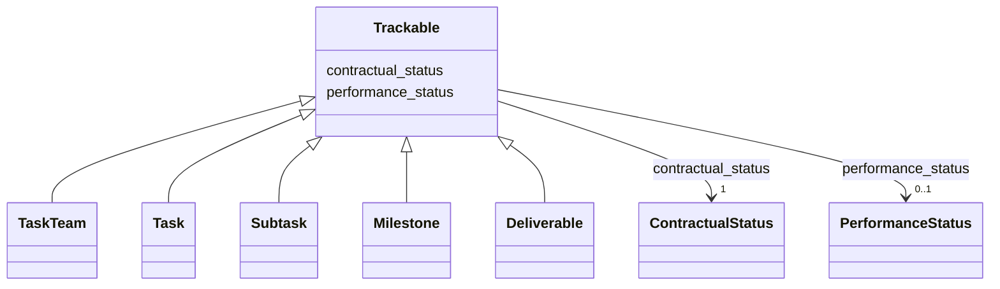

# Class: Trackable 


_Dual-axis status for any contractually-managed element._


URI: [sow:Trackable](https://w3id.org/collabri/sow/Trackable)





<!-- no inheritance hierarchy -->


## Slots

| Name | Cardinality and Range | Description | Inheritance |
| ---  | --- | --- | --- |
| [contractual_status](contractual_status.md) | 1 <br/> [ContractualStatus](ContractualStatus.md) |  | direct |
| [performance_status](performance_status.md) | 0..1 <br/> [PerformanceStatus](PerformanceStatus.md) |  | direct |


## Mixin Usage

| mixed into | description |
| --- | --- |
| [TaskTeam](TaskTeam.md) | Root of a SOW |
| [Task](Task.md) | Thematic bucket of work, possibly spanning the full award |
| [Subtask](Subtask.md) | A step toward completion of a Task |
| [Milestone](Milestone.md) | A milestone is a collection of subtasks (linked via Subtask |
| [Deliverable](Deliverable.md) | Artifact produced by a single subtask |


## Identifier and Mapping Information


### Schema Source


* from schema: https://w3id.org/collabri/sow


## Mappings

| Mapping Type | Mapped Value |
| ---  | ---  |
| self | sow:Trackable |
| native | sow:Trackable |


## LinkML Source

<!-- TODO: investigate https://stackoverflow.com/questions/37606292/how-to-create-tabbed-code-blocks-in-mkdocs-or-sphinx -->

### Direct

<details>
```yaml
name: Trackable
description: Dual-axis status for any contractually-managed element.
from_schema: https://w3id.org/collabri/sow
mixin: true
attributes:
  contractual_status:
    name: contractual_status
    from_schema: https://w3id.org/collabri/sow
    rank: 1000
    domain_of:
    - Trackable
    range: ContractualStatus
    required: true
  performance_status:
    name: performance_status
    from_schema: https://w3id.org/collabri/sow
    rank: 1000
    domain_of:
    - Trackable
    range: PerformanceStatus

```
</details>

### Induced

<details>
```yaml
name: Trackable
description: Dual-axis status for any contractually-managed element.
from_schema: https://w3id.org/collabri/sow
mixin: true
attributes:
  contractual_status:
    name: contractual_status
    from_schema: https://w3id.org/collabri/sow
    rank: 1000
    alias: contractual_status
    owner: Trackable
    domain_of:
    - Trackable
    range: ContractualStatus
    required: true
  performance_status:
    name: performance_status
    from_schema: https://w3id.org/collabri/sow
    rank: 1000
    alias: performance_status
    owner: Trackable
    domain_of:
    - Trackable
    range: PerformanceStatus

```
</details>