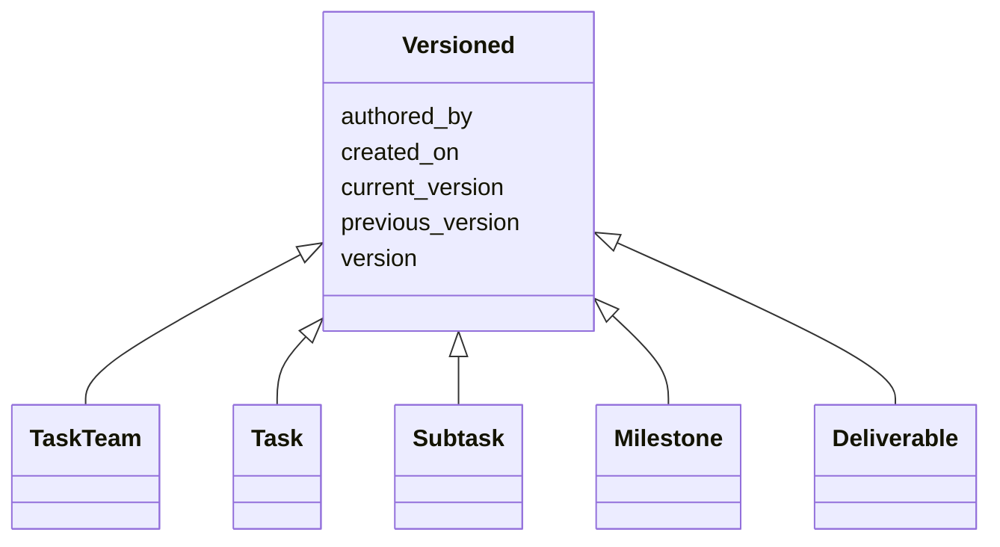

# Class: Versioned 


_Per-element version metadata, aligned with PAV and PROV._


URI: [sow:Versioned](https://w3id.org/collabri/sow/Versioned)





<!-- no inheritance hierarchy -->


## Slots

| Name | Cardinality and Range | Description | Inheritance |
| ---  | --- | --- | --- |
| [version](version.md) | 0..1 <br/> [String](String.md) | Semantic version of this element | direct |
| [previous_version](previous_version.md) | 0..1 <br/> [Uriorcurie](Uriorcurie.md) | IRI of the immediately prior version of this element | direct |
| [current_version](current_version.md) | 0..1 <br/> [Boolean](Boolean.md) | True iff this is the current accepted version of the element | direct |
| [created_on](created_on.md) | 0..1 <br/> [Date](Date.md) |  | direct |
| [authored_by](authored_by.md) | * <br/> [Uriorcurie](Uriorcurie.md) |  | direct |


## Mixin Usage

| mixed into | description |
| --- | --- |
| [TaskTeam](TaskTeam.md) | Root of a SOW |
| [Task](Task.md) | Thematic bucket of work, possibly spanning the full award |
| [Subtask](Subtask.md) | A step toward completion of a Task |
| [Milestone](Milestone.md) | A milestone is a collection of subtasks (linked via Subtask |
| [Deliverable](Deliverable.md) | Artifact produced by a single subtask |


## Identifier and Mapping Information


### Schema Source


* from schema: https://w3id.org/collabri/sow


## Mappings

| Mapping Type | Mapped Value |
| ---  | ---  |
| self | sow:Versioned |
| native | sow:Versioned |


## LinkML Source

<!-- TODO: investigate https://stackoverflow.com/questions/37606292/how-to-create-tabbed-code-blocks-in-mkdocs-or-sphinx -->

### Direct

<details>
```yaml
name: Versioned
description: Per-element version metadata, aligned with PAV and PROV.
from_schema: https://w3id.org/collabri/sow
mixin: true
attributes:
  version:
    name: version
    description: Semantic version of this element.
    from_schema: https://w3id.org/collabri/sow
    rank: 1000
    slot_uri: pav:version
    domain_of:
    - Versioned
  previous_version:
    name: previous_version
    description: IRI of the immediately prior version of this element.
    from_schema: https://w3id.org/collabri/sow
    rank: 1000
    slot_uri: pav:previousVersion
    domain_of:
    - Versioned
    range: uriorcurie
  current_version:
    name: current_version
    description: True iff this is the current accepted version of the element.
    from_schema: https://w3id.org/collabri/sow
    rank: 1000
    slot_uri: pav:hasCurrentVersion
    domain_of:
    - Versioned
    range: boolean
  created_on:
    name: created_on
    from_schema: https://w3id.org/collabri/sow
    rank: 1000
    slot_uri: pav:createdOn
    domain_of:
    - Versioned
    range: date
  authored_by:
    name: authored_by
    from_schema: https://w3id.org/collabri/sow
    rank: 1000
    slot_uri: pav:authoredBy
    domain_of:
    - Versioned
    range: uriorcurie
    multivalued: true

```
</details>

### Induced

<details>
```yaml
name: Versioned
description: Per-element version metadata, aligned with PAV and PROV.
from_schema: https://w3id.org/collabri/sow
mixin: true
attributes:
  version:
    name: version
    description: Semantic version of this element.
    from_schema: https://w3id.org/collabri/sow
    rank: 1000
    slot_uri: pav:version
    alias: version
    owner: Versioned
    domain_of:
    - Versioned
    range: string
  previous_version:
    name: previous_version
    description: IRI of the immediately prior version of this element.
    from_schema: https://w3id.org/collabri/sow
    rank: 1000
    slot_uri: pav:previousVersion
    alias: previous_version
    owner: Versioned
    domain_of:
    - Versioned
    range: uriorcurie
  current_version:
    name: current_version
    description: True iff this is the current accepted version of the element.
    from_schema: https://w3id.org/collabri/sow
    rank: 1000
    slot_uri: pav:hasCurrentVersion
    alias: current_version
    owner: Versioned
    domain_of:
    - Versioned
    range: boolean
  created_on:
    name: created_on
    from_schema: https://w3id.org/collabri/sow
    rank: 1000
    slot_uri: pav:createdOn
    alias: created_on
    owner: Versioned
    domain_of:
    - Versioned
    range: date
  authored_by:
    name: authored_by
    from_schema: https://w3id.org/collabri/sow
    rank: 1000
    slot_uri: pav:authoredBy
    alias: authored_by
    owner: Versioned
    domain_of:
    - Versioned
    range: uriorcurie
    multivalued: true

```
</details>